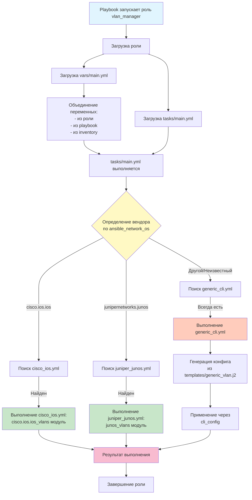

# Ansible для Сетевого Оборудования: From Zero to Hero

**Предварительные требования:**
- Установите Ansible: `pip install ansible` или через пакетный менеджер (e.g., `apt install ansible` на Ubuntu).
- Для сетевых модулей: `ansible-galaxy collection install ansible.netcommon` (универсальные инструменты для CLI).
- Для вендор-специфичных: `ansible-galaxy collection install cisco.ios` (для Cisco IOS), `junipernetworks.junos` и т.д.
- Тестируйте на эмуляторах (e.g., GNS3, Containerlab) или реальных устройствах с SSH-доступом.
- ansible.cfg: Создайте файл с `host_key_checking = False` для упрощения подключений и `forks=50` для параллелизма на сотнях устройств.

## Шаг 1: Простейший Playbook для Одного Устройства (Zero Level)

Начнем с базового: выполним простую команду (e.g., `show version`) на одном сетевом устройстве. Это вводит ключевые элементы Ansible: **playbook** (YAML-файл с инструкциями), **inventory** (список хостов) и **модули** (готовые функции для задач).

**Создайте inventory (inventory.ini):**
```ini
[switches]
switch1 ansible_host=192.168.1.10 ansible_user=admin ansible_password=secret ansible_network_os=ios ansible_connection=network_cli
```
- `ansible_host`: IP-адрес устройства.
- `ansible_user/password`: Учетные данные (в production используйте ansible-vault для секретов).
- `ansible_network_os`: Указывает ОС (e.g., `ios` для Cisco; обязательно задавать вручную, так как не определяется автоматически gather_facts).
- `ansible_connection=network_cli`: Подключение по SSH с CLI (вместо `local` для серверов).

**Создайте playbook (simple_show.yml):**
```yaml
---
- name: Show version on switch
  hosts: switch1  # Цель: хост из inventory
  gather_facts: false  # Не собираем системные факты (не нужны для сетевого оборудования)

  tasks:
    - name: Run show version
      ansible.netcommon.cli_command:  # Универсальный модуль для CLI-команд
        command: show version
      register: output  # Сохраняем вывод в переменную 'output'

    - name: Display output
      ansible.builtin.debug:  # Модуль для отладки (выводит переменные)
        msg: "{{ output.stdout }}"  # Выводим содержимое (Jinja2-синтаксис для переменных)
```
- **Синтаксис playbook**: Начинается с `---`, затем plays (группы задач). `hosts` — цели, `tasks` — список задач.
- **Модуль `cli_command`**: Выполняет команду и возвращает вывод. Не меняет конфигурацию (только "show").
- **register**: Сохраняет результат в переменную для дальнейшего использования.
- **debug**: Выводит информацию (полезно для тестирования).

**Запуск:** `ansible-playbook -i inventory.ini simple_show.yml`
- Это выполнит `show version` на switch1 и покажет вывод. Если устройство недоступно, playbook упадет с ошибкой.

**Что мы достигли:** Простое чтение данных с устройства. Нет изменений — безопасно для production.

## Шаг 2: Добавляем Несколько Устройств и Группы (Basic Scaling)

Теперь масштабируем на несколько устройств. Введем **группы в inventory** для логической организации (e.g., по вендорам или площадкам) и **loops** для повторяющихся задач.

**Обновите inventory.ini:**
```ini
[switches]
switch1 ansible_host=192.168.1.10 ansible_user=admin ansible_password=secret ansible_network_os=ios ansible_connection=network_cli
switch2 ansible_host=192.168.1.11 ansible_user=admin ansible_password=secret ansible_network_os=junos ansible_connection=network_cli

[cisco_switches]
switch1

[juniper_switches]
switch2

[all_switches:children]  # Группа, включающая подгруппы
cisco_switches
juniper_switches
```
- Группы позволяют запускать playbook на подмножествах устройств (e.g., `hosts: cisco_switches`). Для нескольких площадок добавьте группы вроде `[site_a]` и используйте NetBox для динамики (см. Шаг 7).

**Обновленный playbook (multi_show.yml):**
```yaml
---
- name: Show version on multiple switches
  hosts: all_switches
  gather_facts: false

  tasks:
    - name: Run show commands
      ansible.netcommon.cli_command:
        command: "{{ item }}"  # Loop по списку команд
      register: outputs
      loop:  # Цикл: выполняет задачу для каждого элемента
        - show version
        - show interfaces brief

    - name: Display outputs
      ansible.builtin.debug:
        msg: "Command '{{ item.item }}' output: {{ item.stdout }}"
      loop: "{{ outputs.results }}"  # Loop по результатам
```
- **loop**: Повторяет задачу для списка (здесь — команды). Полезно для повторяющихся действий на сотнях устройств.
- **register с loop**: Сохраняет массив результатов (`outputs.results`).

**Запуск:** `ansible-playbook -i inventory.ini multi_show.yml --limit switch1` (опция `--limit` для конкретного хоста).
- Это выполнит команды на всех switches, но масштабируемо: Ansible параллелизирует (по умолчанию 5 форков; настройте в ansible.cfg для сотен устройств).

**Что мы достигли:** Базовое масштабирование. Для production: Добавьте `serial: 10%` в play для постепенного rollout (e.g., 10% устройств за раз, чтобы избежать сбоев в сети).

## Шаг 3: Изменение Конфигурации с Идемпотентностью (Safe Changes)

Теперь перейдем к изменениям (e.g., создание VLAN). Введем **идемпотентность** (playbook не меняет то, что уже настроено) с помощью `register`, `when` (условные конструкции) и модуля `cli_config`.

**Playbook (vlan_create.yml):**
```yaml
---
- name: Create VLAN if not exists
  hosts: switches
  gather_facts: false

  tasks:
    - name: Check if VLAN 100 exists
      ansible.netcommon.cli_command:
        command: show vlan id 100
      register: vlan_check
      ignore_errors: true  # Игнорируем ошибку, если VLAN не найден

    - name: Create VLAN 100
      ansible.netcommon.cli_config:  # Модуль для конфигурационных команд
        config: |
          vlan 100
          name "Guest"
      when: vlan_check.failed or "not found" in vlan_check.stdout  # Условие: только если не существует

    - name: Verify VLAN
      ansible.netcommon.cli_command:
        command: show vlan id 100
      failed_when: "'VLAN 100' not in result.stdout"  # Провал, если не создан
      register: result
```
- **cli_config**: Выполняет команды в режиме конфигурации (e.g., `conf t`).
- **when**: Условное выполнение (Jinja2-выражение). Делает задачу идемпотентной.
- **failed_when**: Кастомная проверка на ошибку.
- **ignore_errors**: Продолжает playbook даже при ошибке (полезно для проверок).

**Запуск с dry-run:** `ansible-playbook vlan_create.yml --check` (симулирует без изменений).
- Для production: Добавьте `check_mode: yes` в задачи для безопасного тестирования.

**Что мы достигли:** Безопасные изменения. Это работает с CLI любых вендоров (адаптируйте команды в `command`/`config`).

## Шаг 4: Мультивендорность с Условной Логикой

Для мультивендорности используем факт `ansible_network_os` (задается вручную в inventory) и `when` для выбора задач. Это позволяет один playbook для разных вендоров (e.g., Cisco SG без модулей vs. IOS с модулями). **Важно:** `ansible_network_os` не определяется автоматически; всегда указывайте его в inventory.

**Playbook (multi_vendor_vlan.yml):**
```yaml
---
- name: Multi-vendor VLAN creation
  hosts: all_switches
  gather_facts: false  # Избегаем ошибок для неподдерживаемых ОС (см. ниже)

  tasks:
    - name: Create VLAN (Cisco IOS module)
      cisco.ios.ios_vlans:  # Вендор-специфичный модуль (идемпотентный!)
        config:
          - vlan_id: 100
            name: Guest
        state: merged
      when: ansible_network_os == 'cisco.ios.ios'  # Условие по ОС

    - name: Create VLAN (Juniper module)
      junipernetworks.junos.junos_vlans:
        config:
          - vlan_id: 100
            name: Guest
        state: merged
      when: ansible_network_os == 'junipernetworks.junos.junos'

    - name: Create VLAN (Generic CLI for others)
      ansible.netcommon.cli_config:
        config: "vlan 100 name Guest"  # Адаптируйте для вендора
      when: ansible_network_os not in ['cisco.ios.ios', 'junipernetworks.junos.junos']
```
- **gather_facts: false**: Рекомендуется по умолчанию для мультивендорности, чтобы избежать ошибок на неподдерживаемых устройствах.
- **Вендор-специфичные модули**: Декларативны и идемпотентны (предпочтительны, если доступны). См. [Ansible Network Modules](https://docs.ansible.com/ansible/latest/network/index.html).
- **when для мультивендорности**: Выбирает логику на основе фактов.

**Что мы достигли:** Один playbook для смешанной среды. Для неизвестных вендоров (e.g., Zyxel) fallback на `cli_config` с ручной идемпотентностью (как в Шаге 3).

### Подраздел: Работа с Фактами и Неподдерживаемыми Устройствами

`gather_facts` в Ansible для сетевого оборудования работает только для поддерживаемых ОС (e.g., Cisco IOS с `ios_facts`, Juniper Junos с `junos_facts`). Он собирает детали вроде модели, версии, интерфейсов. Для неподдерживаемых (e.g., Zyxel, D-Link) gather_facts не применим и может вызвать ошибки.

- **Поведение с `gather_facts: true` на неподдерживаемом хосте**: Playbook попытается собрать факты, но без подходящего модуля (e.g., `_facts`) упадет с ошибкой (e.g., "No facts module for this platform"). Это нарушит выполнение для всего play.
- **Рекомендации**:
  - Задавайте `ansible_network_os` вручную в inventory для всех устройств.
  - Устанавливайте `gather_facts: false` по умолчанию в мультивендорных playbook'ах.
  - Для ручного сбора фактов используйте `cli_command`:
    ```yaml
    - name: Manual facts gathering
      ansible.netcommon.cli_command:
        command: show version
      register: version_output
      when: ansible_network_os not in ['cisco.ios.ios', 'junipernetworks.junos.junos']  # Только для неподдерживаемых
    ```
  - Если нужны факты для поддерживаемых: Включите gather_facts selectively (e.g., в отдельном play или with `when`).
- **Масштаб и площадки**: В больших средах (сотни устройств) используйте динамический inventory из NetBox, чтобы автоматически задавать `ansible_network_os` на основе тегов/моделей.

См. [Ansible Network Best Practices](https://docs.ansible.com/ansible/latest/network/user_guide/network_best_practices_2.5.html) для деталей.

## Шаг 5: Jinja2-Шаблоны для Генерации Конфигураций

Для сложных/повторяющихся конфигов используем **Jinja2-шаблоны** (`.j2` файлы с переменными/циклами). Это отделяет данные от логики, идеально для шаблонизации (e.g., базовая настройка для сотен устройств).

**Создайте шаблон (templates/base_config.j2):**
```jinja
hostname {{ hostname }}
vlan {{ vlan_id }}
  name "{{ vlan_name }}"

interface {{ intf.name }}
  switchport mode access
  switchport access vlan {{ vlan_id }}

```
- Jinja2: `{{ var }}` для переменных, `` для циклов.

**Playbook (template_vlan.yml):**
```yaml
---
- name: Apply templated config
  hosts: switches
  gather_facts: false
  vars:  # Переменные (могут быть в group_vars или extra-vars)
    hostname: "{{ inventory_hostname }}"  # Встроенная переменная
    vlan_id: 100
    vlan_name: Guest
    interfaces: [{name: GigabitEthernet1/0/1}, {name: GigabitEthernet1/0/2}]

  tasks:
    - name: Generate config from template
      ansible.builtin.template:  # Модуль для рендеринга Jinja2
        src: templates/base_config.j2
        dest: "/tmp/{{ inventory_hostname }}_config.txt"
      delegate_to: localhost  # Выполнить локально на контроллере

    - name: Apply generated config
      ansible.netcommon.cli_config:
        src: "/tmp/{{ inventory_hostname }}_config.txt"
```
- **vars**: Определяют переменные (локальные, групповые или глобальные).
- **template**: Генерирует файл на основе шаблона.
- **delegate_to**: Запускает задачу не на хосте, а локально (полезно для генерации).

**Что мы достигли:** Масштабируемые, кастомизированные конфиги. Для production: Храните шаблоны в Git, передавайте vars из NetBox. Адаптируйте шаблоны под вендоров с `when`.

## Шаг 6: Роли для Модульности, Переиспользования и Мультивендорности

Роли — это переиспользуемые блоки кода в Ansible, которые инкапсулируют задачи, переменные, шаблоны и логику. Они идеальны для сетевой автоматизации, где задачи повторяются (e.g., создание VLAN, обновление ACL) на сотнях устройств. **Применимость ролей**:
- **Модульность**: Разделяют сложные playbook'и на независимые компоненты (e.g., роль для VLAN, роль для интерфейсов).
- **Переиспользование**: Одна роль может использоваться в множестве playbook'ов (e.g., для initial setup или one-time задач).
- **Мультивендорность**: Внутри роли используйте условную логику (`when`, `include_tasks`) для выбора vendor-specific задач, делая роль универсальной.
- **Масштаб**: В больших средах (сотни устройств, несколько площадок) роли упрощают поддержку — обновите роль один раз, и все playbook'и выиграют.
- **Структура роли**: Директория с поддиректориями (tasks/, vars/, templates/, etc.). Ansible автоматически загружает `tasks/main.yml` при вызове роли.

**Пример структуры роли (roles/vlan_manager/):**
```
roles/vlan_manager/
├── tasks/
│   ├── main.yml                  # Главный файл: маршрутизация логики
│   ├── cisco_ios.yml             # Задачи для Cisco IOS
│   ├── juniper_junos.yml         # Задачи для Juniper Junos
│   └── generic_cli.yml           # Fallback для других вендоров
├── templates/
│   └── generic_vlan.j2           # Jinja2-шаблон для CLI
└── vars/
    └── main.yml                  # Переменные по умолчанию (e.g., vlan_list)
```

**vars/main.yml (пример переменных):**
```yaml
vlan_list:
  - vlan_id: 100
    name: Guest
```

**tasks/main.yml (маршрутизация мультивендорной логики):**
```yaml
- name: Include vendor-specific tasks
  include_tasks: "{{ item }}"
  with_first_found:  # Динамически выбирает первый подходящий файл
    - "{{ ansible_network_os }}.yml"  # e.g., cisco_ios.yml
    - "generic_cli.yml"               # Fallback
```

**tasks/cisco_ios.yml (vendor-specific):**
```yaml
- name: Create VLAN on Cisco IOS
  cisco.ios.ios_vlans:
    config: "{{ vlan_list }}"
    state: merged
```

**tasks/juniper_junos.yml:**
```yaml
- name: Create VLAN on Juniper Junos
  junipernetworks.junos.junos_vlans:
    config: "{{ vlan_list }}"
    state: merged
```

**tasks/generic_cli.yml (fallback с шаблоном):**
```yaml
- name: Generate config for generic device
  ansible.builtin.template:
    src: generic_vlan.j2
    dest: "/tmp/{{ inventory_hostname }}_vlan.txt"
  delegate_to: localhost

- name: Apply config
  ansible.netcommon.cli_config:
    src: "/tmp/{{ inventory_hostname }}_vlan.txt"
```

**templates/generic_vlan.j2:**
```jinja

vlan {{ vlan.vlan_id }}
  name "{{ vlan.name }}"

```

**Playbook (role_based.yml), вызывающий роль:**
```yaml
---
- name: Manage VLANs with role
  hosts: all_switches
  gather_facts: false
  roles:
    - vlan_manager  # Автоматически выполнит tasks/main.yml
  vars_files:
    - vars/vlans.yml  # Дополнительные vars (e.g., из NetBox)
```
- **include_tasks с with_first_found**: Ключевой прием для мультивендорности — Ansible пробует файлы по порядку и выбирает первый найденный.
- **Преимущества в production**: Роли позволяют команде инженеров делить ответственность (e.g., один разрабатывает роль для Cisco, другой — для Zyxel). Для повторяющихся задач (e.g., добавление IP в ACL) создайте роль с параметрами (vars), передаваемыми через `--extra-vars`.


**Что мы достигли:** Модульный, переиспользуемый код. Роли интегрируются с шаблонами и условной логикой, делая их основой для library в мультивендорной среде. См. [Ansible Roles Docs](https://docs.ansible.com/ansible/latest/playbook_guide/playbooks_reuse_roles.html).

## Шаг 7: Динамический Inventory с NetBox и Плагином nb_inventory (SoT Integration)

Для сотен устройств по нескольким площадкам используйте **динамический inventory** из NetBox как Source of Truth (SoT). Мы фокусируемся на официальном плагине `nb_inventory` из коллекции `netbox.netbox` (для Ansible 2.10+). Это автоматически генерирует хосты на основе данных NetBox (devices, IPs, tags, sites), включая `ansible_network_os`, и группирует по площадкам/тегам.

**Настройка плагина:**
- Установите коллекцию: `ansible-galaxy collection install netbox.netbox`.
- Создайте файл inventory (inventory.yml):
  ```yaml
  ---
  plugin: netbox.netbox.nb_inventory  # Плагин для динамического inventory
  api_endpoint: https://your-netbox-url  # URL NetBox
  token: your-netbox-api-token  # API-токен (храните в vault)
  validate_certs: false  # Если self-signed сертификат
  compose:  # Маппинг NetBox-данных на Ansible-vars
    ansible_network_os: platform.slug  # e.g., 'ios' из NetBox platform
    ansible_host: primary_ip.address
    ansible_user: custom_fields.ansible_user  # Если храните в custom fields
  query_filters:  # Фильтры для устройств
    - status: active
    - tag: managed  # Только устройства с тегом 'managed'
  group_by:  # Автоматические группы
    - sites  # Группы по площадкам (e.g., site-a, site-b)
    - manufacturers  # По вендорам (e.g., cisco, juniper)
    - device_types  # По типам (e.g., switch, router)
  ```
- ansible.cfg: `inventory = inventory.yml` (или используйте `-i inventory.yml`).

**Преимущества для вашей среды:**
- **Масштаб**: Автоматически тянет сотни устройств из NetBox, без ручного inventory.
- **Площадки**: Группы по `sites` позволяют targeted playbook'и (e.g., `hosts: site-a` для одной площадки).
- **Мультивендорность**: `compose` маппит NetBox-данные (e.g., platform) на `ansible_network_os`, интегрируясь с ролями из Шага 6.
- **Динамика**: Изменения в NetBox (e.g., новый switch с тегом 'new') сразу отражаются в inventory.

**Playbook (netbox_integration.yml), интегрирующий с ролью:**
```yaml
---
- name: Provision VLANs from NetBox inventory
  hosts: sites=site-a  # Фильтр по площадке (группа из nb_inventory)
  gather_facts: false
  roles:
    - vlan_manager  # Роль из Шага 6, использующая ansible_network_os из NetBox
  vars:
    vlan_list: "{{ netbox_custom_vlans }}"  # Vars из NetBox custom fields
```
- **Запуск:** `ansible-playbook netbox_integration.yml` — плагин запросит NetBox API и сгенерирует хосты на лету.
- **Production-tips**: Используйте `fetch_facts: true` в плагине для дополнительных NetBox-данных как vars. Интегрируйте с CI/CD для автоматизированного обновления.

**Что мы достигли:** Полная интеграция NetBox как SoT. Это обеспечивает актуальный inventory для больших мультивендорных сетей с несколькими площадками. См. [nb_inventory Docs](https://docs.ansible.com/ansible/latest/collections/netbox/netbox/nb_inventory_inventory.html).
