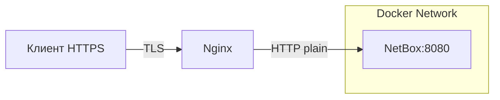

# HTTPS для Docker-сервиса без домена и Let's Encrypt

## Теоретическая часть

Когда сервис в Docker Compose слушает только HTTP, а наружу нужно отдавать HTTPS, проще всего поставить перед ним **reverse proxy** в отдельном контейнере. Он берёт на себя TLS-терминацию, а сам сервис продолжает работать по HTTP внутри Docker-сети.

### Почему reverse proxy, а не встроенный HTTPS в приложение

- Не меняется образ самого приложения.
- Сертификатами управляет один контейнер (можно переиспользовать для нескольких сервисов).
- Легко заменить самоподписанный сертификат на корпоративный или от Let's Encrypt позже.

### Самоподписанный сертификат
Если нет доменного имени и возможности получить доверенный сертификат, используется самоподписанный (self-signed). Браузер будет ругаться на недоверенный сертификат — нужно добавить исключение. Это нормально для внутренних сервисов и тестовых стендов.


<!-- more -->
## Практическая часть

### Кейс: добавление HTTPS к NetBox в Docker Compose

**Исходные данные:**

- Сервис `netbox` работает внутри Docker на порту `8080` (HTTP).
- Docker Compose файлы лежат в `/db/netbox-docker/`, владелец — `root`.
- Наружу нужен порт `443` (HTTPS) без собственного домена.

**Порядок действий:**

1. **Создать структуру каталогов и самоподписанный сертификат**
   ```bash
   cd /db/netbox-docker
   sudo mkdir -p certs nginx
   sudo openssl req -x509 -nodes -days 365 -newkey rsa:2048 \
     -keyout certs/privkey.pem \
     -out certs/fullchain.pem \
     -subj "/CN=netbox.local"
   sudo chmod 644 certs/fullchain.pem
   sudo chmod 600 certs/privkey.pem
   ```
   **Важно:** `privkey.pem` должен быть читаем только владельцем (600). В контейнере nginx мы запустим `user: root`, чтобы избежать проблем с правами на хост-файлах.

2. **Конфигурация Nginx (`nginx/netbox.conf`)**
   ```nginx
   server {
       listen 443 ssl;
       server_name _;   # отвечает на любое имя/IP

       ssl_certificate     /etc/ssl/certs/fullchain.pem;
       ssl_certificate_key /etc/ssl/private/privkey.pem;

       ssl_protocols TLSv1.2 TLSv1.3;
       ssl_ciphers HIGH:!aNULL:!MD5;

       client_max_body_size 25m;

       location / {
           proxy_pass http://netbox:8080;
           proxy_set_header Host $http_host;
           proxy_set_header X-Real-IP $remote_addr;
           proxy_set_header X-Forwarded-For $proxy_add_x_forwarded_for;
           proxy_set_header X-Forwarded-Proto $scheme;
       }
   }
   ```
   **Примечание:** `server_name _;` — универсальный wildcard, подходит для доступа по IP. Когда появится DNS-имя, замените на `server_name netbox.corp.example.com;`.

3. **Создать файл**
   ```bash
   sudo tee /db/netbox-docker/nginx/netbox.conf > /dev/null << 'EOF'
   server {
       listen 443 ssl;
       server_name _;

       ssl_certificate     /etc/ssl/certs/fullchain.pem;
       ssl_certificate_key /etc/ssl/private/privkey.pem;

       ssl_protocols TLSv1.2 TLSv1.3;
       ssl_ciphers HIGH:!aNULL:!MD5;

       client_max_body_size 25m;

       location / {
           proxy_pass http://netbox:8080;
           proxy_set_header Host $http_host;
           proxy_set_header X-Real-IP $remote_addr;
           proxy_set_header X-Forwarded-For $proxy_add_x_forwarded_for;
           proxy_set_header X-Forwarded-Proto $scheme;
       }
   }
   EOF
   sudo chmod 644 /db/netbox-docker/nginx/netbox.conf
   ```

4. **Добавить сервис `nginx` в `docker-compose.override.yml`**

   Блок для вставки в секцию `services:` (после всех существующих):
   ```yaml
     nginx:
       image: nginx:1.27-alpine
       user: root                          # чтобы читать ключ без проблем с правами
       ports:
         - "443:443"
       volumes:
         - ./nginx/netbox.conf:/etc/nginx/conf.d/default.conf:ro
         - ./certs/fullchain.pem:/etc/ssl/certs/fullchain.pem:ro
         - ./certs/privkey.pem:/etc/ssl/private/privkey.pem:ro
       restart: unless-stopped
       depends_on:
         netbox:
           condition: service_healthy
   ```

   **Одновременно в сервисе `netbox` убрать прямое expose порта наружу:**
   ```yaml
     netbox:
       # ... остальные параметры
       # ports:          # <-- закомментировать
       #   - "8000:8080"
   ```

5. **Перезапустить контейнеры**
   ```bash
   cd /db/netbox-docker
   sudo docker compose up -d
   ```

6. **Проверка**
   Открыть в браузере `https://<IP-адрес сервера>`. Принять предупреждение о недоверенном сертификате.

### Замена сертификата на корпоративный

Когда появятся настоящие сертификат и DNS-имя:

- Заменить файлы в `certs/` (сохранив права 644/600).
- В `nginx/netbox.conf` поменять `server_name _` на реальное имя.
- Выполнить `sudo docker compose restart nginx`.

### Права доступа к файлам (сводка)

| Путь относительно проекта | Владелец | Режим |
|----------------------------|----------|-------|
| `certs/fullchain.pem`      | root     | 644   |
| `certs/privkey.pem`        | root     | 600   |
| `nginx/netbox.conf`        | root     | 644   |

**Важно:** В контейнере Nginx запущен `user: root`, поэтому права доступа к примонтированным файлам не критичны. Если по соображениям безопасности потребуется запускать Nginx под `nginx` (uid 101), нужно будет выставить соответствующие права на хост-файлы (chown 101:101) или добавить пользователя в группу.

### Источники

- [nginx — Docker Hub](https://hub.docker.com/_/nginx)
- [NGINX: Deploying with Docker](https://docs.nginx.com/nginx/admin-guide/installing-nginx/installing-nginx-docker/)