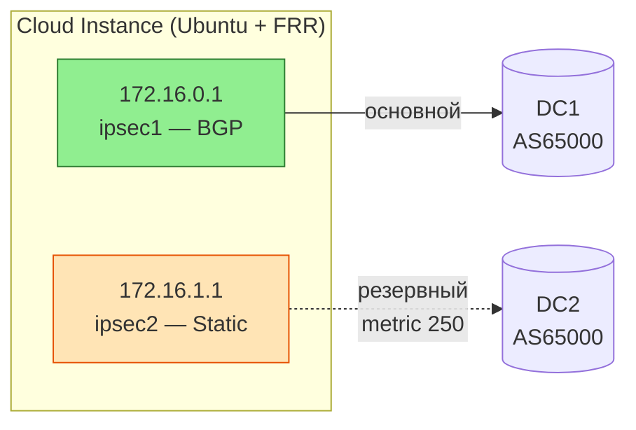

##### Схема



| Подсеть / IP | Роль |
|-------------|------|
| `10.10.10.0/24` | Локальная сеть инстанса (анонсируется в BGP) |
| `172.16.0.0/31` | Туннель 1 — основной (BGP пир: `.0`) |
| `172.16.1.0/31` | Туннель 2 — резервный (Static next-hop: `.0`) |
| `192.168.0.0/24` | Сеть назначения за туннелями (On-Prem) |

**Failover:** при падении BGP-сессии маршрут переключается на статический (metric 250).

##### Устанавливаем пакеты

```bash
sudo apt update && sudo apt install -y \
  strongswan \
  strongswan-swanctl \
  frr \
  frr-pythontools \
  iproute2 \
  tcpdump
```

##### sysctl.conf

```bash
cat <<EOF | sudo tee /etc/sysctl.d/99-ipsec.conf
net.ipv4.ip_forward = 1
net.ipv6.conf.all.disable_ipv6 = 1
net.ipv6.conf.default.disable_ipv6 = 1
net.ipv6.conf.lo.disable_ipv6 = 1
EOF
sudo sysctl --system
```

##### Служба для поднятия интерфейсов

```ini /etc/systemd/system/ipsec-xfrm-interfaces.service
# /etc/systemd/system/ipsec-xfrm-interfaces.service
# Предварительно проверяем название интерфейса инстанса, возможно его нужно будет зафиксировать через netplan

[Unit]
Description=Create IPsec XFRM interfaces
After=network-online.target
Before=strongswan.service frr.service
Wants=network-online.target

[Service]
Type=oneshot
RemainAfterExit=yes
ExecStart=/bin/sh -c '\
  (ip link show ipsec1 >/dev/null 2>&1 || (ip link add ipsec1 mtu 1400 type xfrm dev eth0 if_id 1 && ip addr add 172.16.0.1/31 dev ipsec1 && ip link set ipsec1 up)) && \
  (ip link show ipsec2 >/dev/null 2>&1 || (ip link add ipsec2 mtu 1400 type xfrm dev eth0 if_id 2 && ip addr add 172.16.1.1/31 dev ipsec2 && ip link set ipsec2 up))'

ExecStop=/bin/sh -c '\
  ip link del ipsec1 2>/dev/null; \
  ip link del ipsec2 2>/dev/null'

[Install]
WantedBy=multi-user.target
```


##### Создаём конфиг для strongswan
```conf /etc/swanctl/swanctl.conf
# /etc/swanctl/swanctl.conf
# Представлен вариант конфига с использованием общих для разных соединений настроек

conn-defaults {
  local_addrs = <INSTANCE-INTERNAL-IP>

  remote {
    auth = psk
  }

  local {
    id = <INSTANCE-PUB-IP>
    auth = psk
  }

  version = 2
  mobike = no
  proposals = aes256-sha256-prfsha256-modp2048
  dpd_delay = 30s
  rekey_time = 23h
  rand_time  = 5m
}

child-defaults {
  local_ts  = 0.0.0.0/0
  remote_ts = 0.0.0.0/0

  life_time  = 1800s
  rekey_time = 1620s
  rand_time  = 60s

  start_action = start
  close_action = restart
  dpd_action   = restart

  esp_proposals = aes256-sha1-modp2048,aes256-sha256-modp2048
}

connections {
  DC1 : conn-defaults {
    remote_addrs = <ONPREM-PUB-IP1>

    if_id_in  = 1
    if_id_out = 1

    remote {
      id = <ONPREM-PUB-IP1>
    }

    children {
      child : child-defaults {}
    }
  }

  DC2 : conn-defaults {
    remote_addrs = <ONPREM-PUB-IP2>

    if_id_in  = 2
    if_id_out = 2

    remote {
      id = <ONPREM-PUB-IP2>
    }

    children {
      child : child-defaults {}
    }
  }
}

secrets {

     ike-1 {
         id = <ONPREM-PUB-IP1>
         secret = "<secret-key>"
	}
     ike-2 {
         id = <ONPREM-PUB-IP2>
         secret = "<secret-key>"
	}
}

```

##### Команды

```bash
# Проверяем синтаксис
systemd-analyze verify /etc/systemd/system/ipsec-xfrm-interfaces.service
# Загружаем конфиги
sudo systemctl daemon-reload
# Запускаем службу
sudo systemctl start ipsec-xfrm-interfaces.service
# Проверяем. Должны подняться интерфейсы ipsec1 и ipsec2
ip a
# Проверяем статус. Должно быть active (exited)
systemctl status ipsec-xfrm-interfaces.service
# Добавляем службы в автозагрузку
sudo systemctl enable ipsec-xfrm-interfaces.service
sudo systemctl enable strongswan

# Проверяем конфиг на наличие синтаксических ошибок
sudo swanctl --load-conns
# Загружаем конфиг
sudo swanctl --load-all
# Смотрим статус соединений
sudo swanctl --list-sas
# Тунельные адреса должны начать пинговаться
```

##### FRR

```bash
# Включаем BGP
sudo sed -i 's/bgpd=no/bgpd=yes/' /etc/frr/daemons
# Перезапускаем и добавляем службу в автозагрузку
sudo systemctl restart frr
sudo systemctl enable frr
# Заходим в консоль конфигурации frr
sudo vtysh
```
```text
conf t
# Статический маршрут через резервный туннель (ipsec2)
ip route 192.168.0.0/24 172.16.1.0 250
!
# BGP на основном туннеле (ipsec1)
router bgp 65001
 bgp router-id 172.16.0.1
 bgp log-neighbor-changes
 no bgp ebgp-requires-policy
 neighbor 172.16.0.0 remote-as 65000
 !
 address-family ipv4 unicast
  # Есть сомнения, что здесь можно ограничить аноснируемые подсети. По факту анонсируются все подсети известные подчети, кроме 0.0.0.0/0
  network 10.10.10.0/24
  neighbor 172.16.0.0 soft-reconfiguration inbound
 exit-address-family
!
 # Если нужен BFD для быстрой сходимости
 neighbor 172.16.0.0 bfd
exit
!
bfd
 peer 172.16.0.0
 exit
!
end
wr
```
