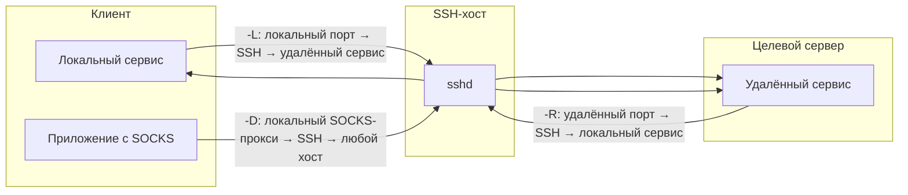

# SSH

## SSH-туннель

SSH-туннель — это механизм инкапсуляции TCP-трафика внутри зашифрованного SSH-соединения.  
Используется, когда прямой сетевой доступ к сервису закрыт, но есть SSH-доступ к промежуточному хосту.

Все режимы проброса работают **поверх исходящего SSH-соединения**, инициатором которого всегда выступает клиент. Сервер не устанавливает обратных подключений.

### Типы проброса


<!-- more -->

| Тип | Флаг | Поведение | Типичный сценарий |
|---|---|---|---|
| **Local Forwarding** | `-L` | Порт на клиенте → SSH → порт на удалённом хосте | Получить доступ к внутреннему сервису за NAT |
| **Remote Forwarding** | `-R` | Порт на сервере → SSH → порт на клиенте | «Выставить наружу» локальный сервис через публичный хост |
| **Dynamic Forwarding** | `-D` | Локальный SOCKS5-прокси → SSH → выход в сеть с сервера | Перенаправить трафик приложения через другой хост |

**Важно:** все три режима работают **поверх исходящего SSH-соединения от клиента к серверу**. Клиент всегда инициатор сессии, сервер не подключается обратно.

---

### Настройка пользователя и sshd для приёма Remote Forward

**Задача:** разрешить ограниченному пользователю пробрасывать конкретный TCP-порт с сервера на свой локальный хост, исключив любую интерактивную активность.

#### 1. Создание пользователя без shell

```bash
# Пользователь без домашней директории и входа в систему
sudo useradd -r -s /usr/sbin/nologin -M ssh-tunnel

# Принудительно создаём домашнюю директорию для ключей
sudo mkdir -p /home/ssh-tunnel/.ssh
```

#### 2. Добавление публичного SSH-ключа

```bash
# Публичный ключ клиента (рекомендуется отдельная пара)
echo "ssh-ed25519 AAAAC3NzaC1l..." | sudo tee /home/ssh-tunnel/.ssh/authorized_keys

# Права — владелец ssh-tunnel, чтение только владельцу
sudo chown -R ssh-tunnel:ssh-tunnel /home/ssh-tunnel
sudo chmod 700 /home/ssh-tunnel/.ssh
sudo chmod 600 /home/ssh-tunnel/.ssh/authorized_keys
```

**Важно:** ключ должен быть сгенерирован специально для туннеля — компрометация не даст доступа к другим учёткам.

#### 3. Конфигурация sshd

Размещаем пользовательский блок в отдельном файле `/etc/ssh/sshd_config.d/ssh-tunnel.conf`:

```ini
# /etc/ssh/sshd_config.d/ssh-tunnel.conf
Match User ssh-tunnel
    PermitOpen 127.0.0.1:56881   # разрешить проброс только на этот адрес:порт
    PermitTTY no
    X11Forwarding no
    AllowTcpForwarding yes
    ForceCommand /bin/false
    GatewayPorts yes
```

**Параметры:**
- `PermitOpen` — список разрешённых назначений `host:port`. Можно указать `any` (любые), либо конкретные адреса и порты. Если требуется одновременно Remote Forward на определённый порт и Dynamic Forward (см. следующий кейс), используйте `PermitOpen any`.
- `GatewayPorts yes` — проброшенный порт слушает все интерфейсы сервера (`0.0.0.0`), а не только `127.0.0.1`.

Применить изменения:

```bash
sudo sshd -t                  # проверка синтаксиса
sudo systemctl reload ssh     # в Debian/Ubuntu служба называется ssh, не sshd
```

#### 4. Запуск туннеля с клиента

```bash
ssh -i ~/.ssh/id_tunnel \
    -o "ServerAliveInterval=30" \
    -o "ServerAliveCountMax=3" \
    -o "ExitOnForwardFailure=yes" \
    -R 0.0.0.0:56881:127.0.0.1:56881 \
    ssh-tunnel@jump.example.internal -N
```

- `-R 0.0.0.0:56881:127.0.0.1:56881` — входящие на порт 56881 сервера пробрасываются на локальный порт 56881.
- `-N` — не запускать оболочку.
- `ExitOnForwardFailure=yes` — прерывать соединение, если проброс не удался.

**Проверка работоспособности:**

```powershell
# На Windows-клиенте: проверить, что локальный сервис слушает порт
netstat -an | findstr ":56881"

# С внешнего хоста: проверить доступность порта на сервере
Test-NetConnection -ComputerName <публичный-IP-сервера> -Port 56881
```

### Dynamic Forwarding (SOCKS-прокси)

**Задача:** использовать удалённый SSH-сервер как SOCKS5-прокси для всего трафика приложения.

С точки зрения сервера это обычное SSH-соединение: дополнительных демонов или настроек, кроме `AllowTcpForwarding yes` (по умолчанию), не требуется. `PermitOpen` в `Match`-блоке, должен быть равен `any`, если необходимо, чтобы SOCKS-прокси устанавливал соединения с произвольными хостами.

#### Запуск SOCKS-прокси на клиенте

```bash
ssh -D 1080 user@ssh-host -N
```

После этого на `localhost:1080` работает SOCKS5-прокси. Приложения можно направлять в него через системные настройки прокси или переменную окружения (если приложение поддерживает SOCKS).

**Примечание:** если одновременно требуется Remote Forward (`-R`) и Dynamic Forward (`-D`), допустимо указать оба флага в одной команде, но в конфигурации сервера для такого пользователя обязательно `PermitOpen any`. Пример корректной конфигурации:

```ini
Match User ssh-tunnel
    PermitOpen any            # обязательно для совместного использования -R и -D
    PermitTTY no
    X11Forwarding no
    AllowTcpForwarding yes
    ForceCommand /bin/false
    GatewayPorts yes
```
