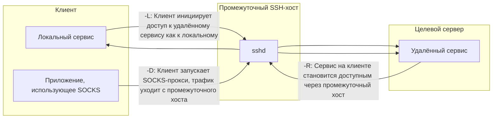

# SSH — доступ, ключи и туннели

## Основы SSH-туннелей (проброса портов)

SSH позволяет пробрасывать TCP-соединения поверх зашифрованной сессии. Это полезно, когда прямой сетевой доступ к сервису закрыт, но есть SSH-доступ к промежуточному хосту.

Схематично три основных режима выглядят так:


<!-- more -->
### Типы проброса

| Тип | Флаг | Поведение | Типичный сценарий |
|---|---|---|---|
| **Local Forwarding** | `-L` | Порт на клиенте → SSH → порт на удалённом хосте | Получить доступ к внутреннему сервису за NAT |
| **Remote Forwarding** | `-R` | Порт на сервере → SSH → порт на клиенте | «Выставить наружу» локальный сервис через публичный хост |
| **Dynamic Forwarding** | `-D` | Локальный SOCKS5-прокси → SSH → выход в сеть с сервера | Перенаправить трафик приложения через другой хост |

**Важно:** все три режима работают **поверх исходящего SSH-соединения от клиента к серверу**. Клиент всегда инициатор сессии, сервер не подключается обратно.

---

## Настройка пользователя и SSH-сервера для приёма туннеля

### Исходные данные

- Требуется, чтобы локальный сервис (например, на Windows) принимал входящие TCP-соединения через проброшенный порт на сервере.  
- Пользователь для туннеля должен иметь минимум прав (без shell, с ограничением проброса конкретным портом).

### Создание пользователя

```bash
# На сервере (Ubuntu): пользователь без shell и домашней директории
sudo useradd -r -s /usr/sbin/nologin -M ssh-tunnel

# Создание домашней директории для ключей (вручную, т.к. -M её не создаёт)
sudo mkdir -p /home/ssh-tunnel/.ssh
```

### Добавление публичного SSH-ключа

```bash
# Публичный ключ клиента копируем в authorized_keys
echo "ssh-ed25519 AAAAC3NzaC1l..." | sudo tee /home/ssh-tunnel/.ssh/authorized_keys

# Права — владелец ssh-tunnel, чтение только для владельца
sudo chown -R ssh-tunnel:ssh-tunnel /home/ssh-tunnel
sudo chmod 700 /home/ssh-tunnel/.ssh
sudo chmod 600 /home/ssh-tunnel/.ssh/authorized_keys
```

**Важно:** для туннеля рекомендуется использовать **отдельную ключевую пару**, чтобы компрометация этого ключа не давала доступ к админской учётке на том же сервере.

### Конфигурация sshd

Рекомендуется размещать пользовательские блоки в отдельных файлах `/etc/ssh/sshd_config.d/`, а не править основной конфиг.

```bash
sudo nano /etc/ssh/sshd_config.d/ssh-tunnel.conf
```

```ini
# /etc/ssh/sshd_config.d/ssh-tunnel.conf
Match User ssh-tunnel
    PermitOpen any
    PermitTTY no
    X11Forwarding no
    AllowTcpForwarding yes
    ForceCommand /bin/false
    GatewayPorts yes
```

**Параметры:**

- `PermitOpen 127.0.0.1:56881 any` — разрешает проброс к любым хостам (`any`).
- `GatewayPorts yes` — позволяет слушать проброшенный порт на всех интерфейсах сервера (`0.0.0.0`), а не только на `127.0.0.1`.

После изменения конфигурации:

```bash
sudo sshd -t                  # проверка синтаксиса
sudo systemctl reload ssh     # применение (в Ubuntu служба называется ssh, не sshd)
```

---

## Запуск туннеля с Windows-клиента

### Разовый запуск для теста

Из PowerShell или cmd (OpenSSH Client должен быть установлен):

```powershell
ssh -i $env:USERPROFILE\.ssh\id_torrent_tunnel `
    -o "ServerAliveInterval=30" `
    -o "ServerAliveCountMax=3" `
    -o "ExitOnForwardFailure=yes" `
    -R 0.0.0.0:56881:127.0.0.1:56881 `
    ssh-tunnel@srv-jump.example.internal -N
```

**Флаги:**

- `-R 0.0.0.0:56881:127.0.0.1:56881` — remote forward: входящие на порт 56881 сервера пробрасываются на локальный порт 56881.
- `-N` — не запускать shell.
- `ServerAliveInterval` и `ServerAliveCountMax` — проверка живости соединения.

### Автоподключение с перезапуском при обрыве

Создайте скрипт `C:\Users\<User>\ssh-tunnel.ps1`:

```powershell
while ($true) {
    ssh -i $env:USERPROFILE\.ssh\id_torrent_tunnel `
        -o "ServerAliveInterval=30" `
        -o "ServerAliveCountMax=3" `
        -o "ExitOnForwardFailure=yes" `
        -R 0.0.0.0:56881:127.0.0.1:56881 `
        ssh-tunnel@srv-jump.example.internal -N
    Start-Sleep -Seconds 15
}
```

Добавьте его в автозагрузку Windows (`Win+R` → `shell:startup`), создав ярлык со строкой запуска:

```powershell
powershell.exe -WindowStyle Hidden -ExecutionPolicy Bypass -File "C:\Users\<User>\ssh-tunnel.ps1"
```

### Проверка работоспособности

```powershell
# На Windows: убедиться, что локальный сервис слушает порт
netstat -an | findstr ":56881"

# С внешнего хоста: проверить доступность порта на сервере
Test-NetConnection -ComputerName <публичный-IP-сервера> -Port 56881
```

---

## Создание ssh-ключей (RSA)

1. На клиенте создаем RSA-ключи. На Windows утилиты должны быть доступны через Git Bash  
```bash
ssh-keygen -t rsa -b 4096 -C "<коментарий>"
```  
2. Конвертируем приватный ключ в pem-формат (при необходимости)
```bash
ssh-keygen -p -f rundeck -m pem
```
3. Содержимое публичного ключа копируем в конец файла `~/.ssh/authorized_keys` на сервере  
4. Современные Ubuntu не разрешают авторизацию по RSA-ключам. Редактируем файл `/etc/ssh/sshd_config`. В конец файла добавляем:
```ini
# Если требуется глобально разрешить rsa
PubkeyAcceptedAlgorithms +ssh-rsa
# Либо разрешить ssh-rsa для определенных адресов/подсетей
Match Address 172.18.0.0/24,192.168.1.100
    PubkeyAcceptedAlgorithms +ssh-rsa
```
5. Рестарт службы ssh для применения изменений конфигурации:  
```bash
sudo systemctl restart ssh
```

**Примечание:** в репозиториях Ubuntu/Debian служба называется `ssh`, в RedHat-совместимых дистрибутивах — `sshd`.

---

## Ошибка REMOTE HOST IDENTIFICATION HAS CHANGED

Эта ошибка возникает после переноса IP-адреса на новый инстанс, когда на клиенте в файле `~/.ssh/known_hosts` сохранен старый ключ хоста.

**Удалить старую запись из known_hosts**
```bash
ssh-keygen -R <IP_адрес_или_домен>
```
