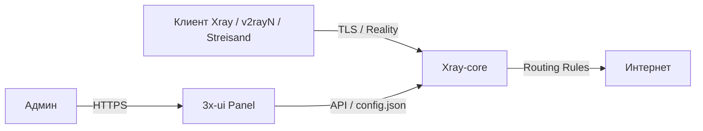
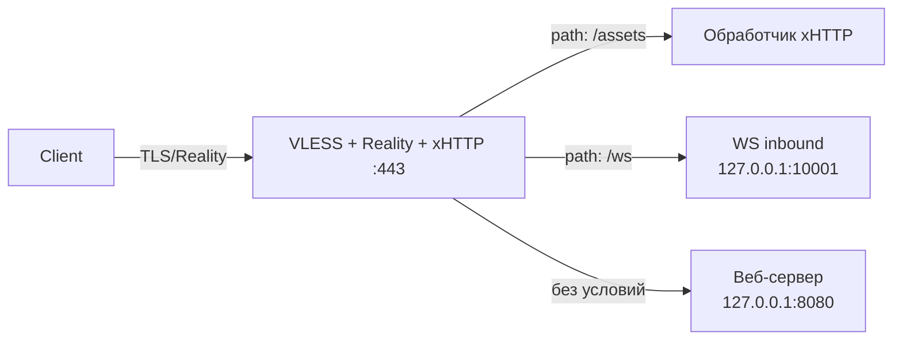

# 3x‑ui — панель управления Xray

3x‑ui — веб‑панель для управления [Xray‑core](https://github.com/XTLS/Xray-core). Позволяет создавать inbound‑подключения (VLESS, VMess, Trojan, Shadowsocks), управлять пользователями, лимитами трафика, маршрутизацией и TLS‑сертификатами.

Xray, в свою очередь, — форк V2Ray с доработанным движком и поддержкой протоколов Reality, XTLS и т.п. Его задача: принимать зашифрованный трафик от клиента, расшифровывать и направлять в интернет (или внутреннюю сеть) согласно правилам маршрутизации.



### Компоненты

| Компонент | Назначение |
|-----------|------------|
| **Xray‑core** | Движок прокси: принимает соединения, расшифровывает, маршрутизирует |
| **3x‑ui панель** | Веб‑интерфейс + API; генерирует `config.json` для Xray |
| **Inbound** | Точка входа для клиентов: протокол, порт, транспорт, TLS |
| **Outbound** | Правила исходящего трафика (freedom, blackhole, warp, …) |
| **Routing** | Логика маршрутизации между inbound и outbound |
<!-- more -->
### Поддерживаемые протоколы (список не полный)

- **VLESS** — лёгкий протокол без шифрования на уровне самого протокола (шифрование обеспечивается TLS)
- **VMess** — протокол со встроенным шифрованием
- **Trojan** — маскируется под HTTPS‑трафик
- **Shadowsocks** — SOCKS5‑подобный прокси
- **Reality** — имитирует TLS‑сессию к реальному сайту без использования сертификата

### Варианты установки

- Голый бинарник + systemd‑сервис
- Docker‑контейнер (рекомендуется для изоляции и быстрого обновления)

Безопасность панели достигается:

- Случайным портом (не дефолтный `2053`)
- Случайным URL‑путём (не `/`)
- SSL‑сертификатом (самоподписанный или Let's Encrypt)
- Rate‑limit
---

### Установка через Docker Compose

```yaml
# /opt/3x-ui/docker-compose.yml
services:
  3x-ui:
    image: ghcr.io/mhsanaei/3x-ui:latest
    container_name: 3x-ui
    restart: unless-stopped
    volumes:
      - ./db:/etc/x-ui
      - ./certs:/etc/x-ui/certs:ro
    ports:
      - "<your-ip>:443:443/tcp"
      - "<your-ip>:2053:2053/tcp"
    environment:
      - XRAY_ENABLED=true
```

```bash
mkdir -p /opt/3x-ui/{db,certs}
cd /opt/3x-ui
docker compose up -d
```

Панель доступна по `http://<your-ip>:2053`

---

### Настройка самоподписанного SSL для панели

```bash
openssl req -x509 -nodes -days 3650 -newkey rsa:2048 \
  -keyout /opt/3x-ui/certs/privkey.pem \
  -out /opt/3x-ui/certs/fullchain.pem \
  -subj "/CN=<your-ip>"
```

В панели: **Settings → Panel Settings → General → Certificates**:

- Public Key Path: `/etc/x-ui/certs/fullchain.pem`
- Private Key Path: `/etc/x-ui/certs/privkey.pem`

---

### Смена порта и URL‑пути панели (security hardening)

В панели: **Settings → Panel Settings**:

| Параметр | До | После (пример) |
|----------|----|-------|
| General → Listen Port | `2053` | `28473` |
| General → URI Path | `/` | `/mypanel7x2/` |
| Subscription → URI Path | `/sub/` | `/sub-d9f3/` |

Сохранить, затем обновить `docker-compose.yml` (проброс порта) и пересоздать контейнер:

```bash
docker compose down && docker compose up -d
```

После этого панель доступна только по `https://<ip>:<новый_порт>/<новый_путь>/`.

---

### XHTTP — транспортый протокол нового поколения

XHTTP — экспериментальный транспорт Xray, работающий поверх HTTP с возможностью имитации потокового видео (MP4‑чанки). В отличие от WebSocket или gRPC, xHTTP отправляет данные чанками с настраиваемым паддингом, что делает трафик визуально неотличимым от обычного HTTP‑потока. Режим **`stream-one`** открывает одно долгоживущее соединение для всего сеанса, снижая число повторных рукопожатий и уменьшая задержки.

---

### Базовый inbound — VLESS + Reality + xhttp

В панели: **Inbounds → Add Inbound**.

#### Основные поля (вкладка General)

| Параметр | Значение |
|----------|----------|
| Protocol | `vless` |
| Port | `443` |

#### Настройки sniffing (вкладка Sniffing)

| Параметр | Значение |
|----------|----------|
| Sniffing | `true` |
| Dest Override | `http, tls, quic` |

#### Transport = xhttp (вкладка Stream → Transport)

| Параметр | Значение |
|----------|----------|
| Network | `xhttp` |
| Path | `/assets` |
| Host | *(оставить пустым)* |
| Mode | `stream-one` |

#### Security = reality (вкладка Stream → Security)

Нажать **Reality → Generate** для генерации ключей.

| Параметр | Значение |
|----------|----------|
| Target | `www.domain.tv:443` |
| Server Names | `www.domain.tv, storage.domain.net` |
| Private Key | *(сгенерированный)* |
| Public Key | *(сгенерированный)* |
| Short IDs | *(сгенерированный)* |
| Fingerprint | `chrome` |
| SpiderX | `/` |

**Примечание:** `Flow` для xhttp не используется — оставить пустым.

#### Добавление клиента (вкладка Clients)

| Параметр | Значение |
|----------|----------|
| Email | `test0` (можно задать любой) |
| UUID | *(сгенерировать кнопкой Generate)* |
| Limit IP | `0` (без лимита) |
| Total GB | `0` (без лимита) |
| Expiry Time | `0` (без срока) |

Панель автоматически сгенерирует ссылку для импорта. Клиенты: v2rayN, Streisand, Hiddify, Sing-box и др.

---

### Fallback — несколько сервисов на одном порту

Xray позволяет одному inbound принимать трафик и, в зависимости от SNI или URL‑пути, направлять его в разные downstream‑обработчики на loopback. Это избавляет от необходимости открывать дополнительные порты наружу.



**Настройка в панели (кратко):**

1. Создать дочерние inbound на `127.0.0.1` с `security: none` и `Proxy Protocol: true`
2. В основном inbound → **Advanced** → добавить в `settings` блок `fallbacks`:

```json
{
  "fallbacks": [
    {
      "path": "/ws",
      "dest": "127.0.0.1:10001",
      "xver": 1
    },
    {
      "dest": "127.0.0.1:8080"
    }
  ]
}
```

**Ограничение:** дочерние inbound **не поддерживают** xHTTP и gRPC — только TCP, WebSocket, HTTPUpgrade.

---

### VPS с двумя публичными IP — inbound на одном, outbound через другой

**Исходные данные:**

- `pub‑ip‑out` — уже используется другими сервисами (не должен быть занят портами панели/Xray)
- `pub‑ip‑in` — выделен под 3x‑ui
- Оба на одном интерфейсе `eth0`

#### 1. Проверить, что порты свободны

```bash
ss -tlnp | grep -E '443|28473'
# На pub‑ip‑in они должны быть свободны
```

#### 2. Привязать inbound к новому IP

В `docker-compose.yml`:

```yaml
ports:
  - "pub‑ip‑in:443:443/tcp"
  - "pub‑ip‑in:28473:28473/tcp"
```

Пересоздать контейнер:

```bash
docker compose down && docker compose up -d
```

#### 3. Заставить исходящий трафик идти через старый IP

Создаётся отдельная Docker‑сеть с известной подсетью и SNAT‑правило:

```yaml
# docker-compose.yml (добавить)
networks:
  default:
    name: xui-net
    driver: bridge
    ipam:
      config:
        - subnet: 172.19.0.0/16
```

```bash
iptables -t nat -A POSTROUTING \
  -s 172.19.0.0/16 -o eth0 \
  -j SNAT --to-source pub‑ip‑out
```

Сохранить правило:

```bash
netfilter-persistent save
# или: iptables-save > /etc/iptables/rules.v4
```

#### 4. Проверить

- **Панель:** `https://pub‑ip‑in:28473/<путь>/`
- **Inbound:** подключиться клиентом → работает
- **Исходящий IP:** с подключённого клиента зайти на `ifconfig.me` → отображается `pub‑ip‑out`

**Важно:** после обновления контейнера (docker compose pull) порты и сети сохраняются, правило SNAT остаётся в iptables.

---

### Rate‑limit

```bash
iptables -A DOCKER-USER -i eth0 -d pub‑ip‑in -p tcp --syn --dport 28473 \
  -m hashlimit --hashlimit-name xui-panel --hashlimit-mode srcip \
  --hashlimit-upto 5/min --hashlimit-burst 10 -j RETURN
iptables -A DOCKER-USER -i eth0 -d pub‑ip‑in -p tcp --syn --dport 28473 -j DROP
```

Правила вставляются **перед** завершающим `-A DOCKER-USER -j RETURN`.

---

### Обновление панели и Xray в Docker Compose

**Контекст:** панель запущена через Docker Compose. Данные (база, бинарник Xray, конфиги) хранятся в директории `/etc/x-ui` внутри контейнера. Способ её хранения на хосте может быть разным:

- **Именованный том** (рекомендуется для production) — например, `xui-data` в примере ниже.
- **Bind‑mount** (проще для экспериментов) — например, `./db` в разделе «Установка через Docker Compose».

Ниже — обе ситуации.

#### Определяем, какой тип используется

```bash
# Показать все тома и bind‑mounts контейнера 3x-ui
docker inspect 3x-ui --format '{{ json .Mounts }}' | jq '.[] | {Type, Source, Destination}'
```

Вывод для именованного тома:
```
{"Type":"volume","Source":"/var/lib/docker/volumes/xui-data/_data","Destination":"/etc/x-ui"}
```

Для bind‑mount:
```
{"Type":"bind","Source":"/opt/3x-ui/db","Destination":"/etc/x-ui"}
```

#### Резервное копирование перед обновлением

**Если используется именованный том (`xui-data` или аналогичный):**

```bash
# Резервная копия именованного тома
docker run --rm \
  -v xui-data:/data \
  -v /opt/3x-ui:/backup \
  alpine tar czf /backup/xui-data-backup-$(date +%Y%m%d).tar.gz -C /data .
```

**Если используется bind‑mount (`./db`):**

```bash
cp -r /opt/3x-ui/db /opt/3x-ui/db.backup-$(date +%Y%m%d)
```

Сертификаты (`./certs`) — отдельный bind‑mount в обоих случаях. При необходимости скопировать отдельно:

```bash
cp -r /opt/3x-ui/certs /opt/3x-ui/certs.backup-$(date +%Y%m%d)
```

**Важно:** в томе/директории лежит база данных панели и бинарник Xray. Без резервной копии при повреждении данных или неудачном обновлении восстановить конфигурацию будет невозможно.

#### Обновление панели (3x‑ui)

Не зависит от типа тома. Обновляется только сам образ контейнера.

```bash
cd /opt/3x-ui

# Скачать актуальный образ
docker compose pull 3x-ui

# Пересоздать контейнер (без -v, чтобы не удалить том!)
docker compose down && docker compose up -d
```

**Важно:** не использовать кнопку обновления в веб‑интерфейсе панели. Она предназначена для bare‑metal установки и при следующем `docker compose up` результат будет потерян — контейнер пересоздастся из старого образа. Единственный штатный способ обновления панели в Docker — `docker compose pull`.

#### Обновление Xray‑core

Бинарник Xray лежит внутри тома/директории (`/etc/x-ui/bin/xray`), поэтому обновление через кнопку в панели сохраняется между пересозданиями контейнера. Допустимо обновлять Xray из веб‑интерфейса: **Settings → Xray Core → Check for Updates → Update**.

```bash
# После обновления Xray панель перезапустит его автоматически.
# Дополнительных действий с контейнером не требуется.
```

**Важно:** перед обновлением проверить статус релиза на [странице Xray‑core](https://github.com/XTLS/Xray-core/releases). Версии с пометкой «Pre‑release» в production‑среде использовать не рекомендуется. Если текущая версия стабильна и нет критических багов — дождаться стабильного релиза.

#### Проверки после обновления

```bash
# Контейнер в статусе Up
docker ps --filter name=3x-ui

# Панель отвечает (подставить свой порт и путь)
curl -sS -o /dev/null -w "%{http_code}" https://<pub-ip-in>:28473/<путь>/

# Логи на отсутствие ошибок
docker logs --tail 50 3x-ui
```

- Подключиться клиентом к inbound и проверить, что трафик ходит.
- С исходящего IP (если настроен SNAT) зайти на `ifconfig.me` — убедиться, что отображается `pub‑ip‑out`.
- Убедиться, что iptables‑правила (SNAT, rate‑limit) на месте — `docker compose down && up` их не затрагивает.

---

**Источники:**

- [3x‑ui GitHub](https://github.com/MHSanaei/3x-ui)
- [3x‑ui Wiki (Installation)](https://github.com/mhsanaei/3x-ui/wiki/Installation)
- [3x‑ui Wiki (Configuration)](https://github.com/mhsanaei/3x-ui/wiki/Configuration)
