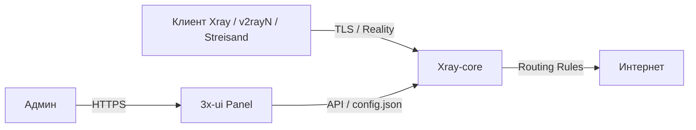

# 3x‑ui — панель управления Xray

3x‑ui — веб‑панель для управления [Xray‑core](https://github.com/XTLS/Xray-core). Позволяет создавать inbound‑подключения (VLESS, VMess, Trojan, Shadowsocks), управлять пользователями, лимитами трафика, маршрутизацией и TLS‑сертификатами.

Xray, в свою очередь, — форк V2Ray с доработанным движком и поддержкой протоколов Reality, XTLS и т.п. Его задача: принимать зашифрованный трафик от клиента, расшифровывать и направлять в интернет (или внутреннюю сеть) согласно правилам маршрутизации.



### Компоненты

| Компонент | Назначение |
|-----------|------------|
| **Xray‑core** | Движок прокси: принимает соединения, расшифровывает, маршрутизирует |
| **3x‑ui панель** | Веб‑интерфейс + API; генерирует `config.json` для Xray |
| **Inbound** | Точка входа для клиентов: протокол, порт, транспорт, TLS |
| **Outbound** | Правила исходящего трафика (freedom, blackhole, warp, …) |
| **Routing** | Логика маршрутизации между inbound и outbound |
<!-- more -->
### Поддерживаемые протоколы (список не полный)

- **VLESS** — лёгкий протокол без шифрования на уровне самого протокола (шифрование обеспечивается TLS)
- **VMess** — протокол со встроенным шифрованием
- **Trojan** — маскируется под HTTPS‑трафик
- **Shadowsocks** — SOCKS5‑подобный прокси
- **Reality** — имитирует TLS‑сессию к реальному сайту без использования сертификата

### Варианты установки

- Голый бинарник + systemd‑сервис
- Docker‑контейнер (рекомендуется для изоляции и быстрого обновления)

Безопасность панели достигается:

- Случайным портом (не дефолтный `2053`)
- Случайным URL‑путём (не `/`)
- SSL‑сертификатом (самоподписанный или Let's Encrypt)
- Rate‑limit на порт панели (iptables)

---

### Установка через Docker Compose

```yaml
# /opt/3x-ui/docker-compose.yml
services:
  3x-ui:
    image: ghcr.io/mhsanaei/3x-ui:latest
    container_name: 3x-ui
    restart: unless-stopped
    volumes:
      - ./db:/etc/x-ui
      - ./certs:/etc/x-ui/certs:ro
    ports:
      - "<your-ip>:443:443/tcp"
      - "<your-ip>:2053:2053/tcp"
    environment:
      - XRAY_ENABLED=true
```

```bash
mkdir -p /opt/3x-ui/{db,certs}
cd /opt/3x-ui
docker compose up -d
```

Панель доступна по `http://<your-ip>:2053`

---

### Настройка самоподписанного SSL для панели

```bash
openssl req -x509 -nodes -days 3650 -newkey rsa:2048 \
  -keyout /opt/3x-ui/certs/privkey.pem \
  -out /opt/3x-ui/certs/fullchain.pem \
  -subj "/CN=<your-ip>"
```

В панели: **Settings → Panel Settings → General → Certificates**:

- Public Key Path: `/etc/x-ui/certs/fullchain.pem`
- Private Key Path: `/etc/x-ui/certs/privkey.pem`

---

### Смена порта и URL‑пути панели (security hardening)

В панели: **Settings → Panel Settings → General → Certificates**:

| Параметр | До | После (пример) |
|----------|----|-------|
| General → Listen Port | `2053` | `28473` |
| General → URI Path | `/` | `/mypanel7x2/` |
| Subscription → URI Path | `/sub/` | `/sub-d9f3/` |

Сохранить, затем обновить `docker-compose.yml` (проброс порта) и пересоздать контейнер:

```bash
docker compose down && docker compose up -d
```

После этого панель доступна только по `https://<ip>:<новый_порт>/<новый_путь>/`.

---

### Базовый inbound — VLESS + Reality

В панели: **Inbounds → Add Inbound**.

Основные поля:

| Параметр | Значение |
|----------|----------|
| Protocol | `vless` |
| Port | `443` |
| Reality | `true` |
| Dest | `www.microsoft.com:443` (пример fallback‑хоста) |
| Flow | `xtls-rprx-vision` |
| Transport | `tcp` |
| Security | `reality` |

Сгенерировать ключи (кнопка **Reality → Generate**). Скопировать полученные `publicKey`, `privateKey`, `shortId`.

В **Clients** добавить пользователя — имя (email), UUID. Панель сгенерирует ссылку для импорта в клиент (v2rayN, Streisand, Hiddify и т.п.).

---

### VPS с двумя публичными IP — inbound на одном, outbound через другой

**Исходные данные:**

- `pub‑ip‑out` — уже используется другими сервисами (не должен быть занят портами панели/Xray)
- `pub‑ip‑in` — выделен под 3x‑ui
- Оба на одном интерфейсе `eth0`

#### 1. Проверить, что порты свободны

```bash
ss -tlnp | grep -E '443|28473'
# На pub‑ip‑in они должны быть свободны
```

#### 2. Привязать inbound к новому IP

В `docker-compose.yml`:

```yaml
ports:
  - "pub‑ip‑in:443:443/tcp"
  - "pub‑ip‑in:28473:28473/tcp"
```

Пересоздать контейнер:

```bash
docker compose down && docker compose up -d
```

#### 3. Заставить исходящий трафик идти через старый IP

Создаётся отдельная Docker‑сеть с известной подсетью и SNAT‑правило:

```yaml
# docker-compose.yml (добавить)
networks:
  default:
    name: xui-net
    driver: bridge
    ipam:
      config:
        - subnet: 172.19.0.0/16
```

```bash
iptables -t nat -A POSTROUTING \
  -s 172.19.0.0/16 -o eth0 \
  -j SNAT --to-source pub‑ip‑out
```

Сохранить правило:

```bash
netfilter-persistent save
# или: iptables-save > /etc/iptables/rules.v4
```

#### 4. Проверить

- **Панель:** `https://pub‑ip‑in:28473/<путь>/`
- **Inbound:** подключиться клиентом → работает
- **Исходящий IP:** с подключённого клиента зайти на `ifconfig.me` → отображается `pub‑ip‑out`

**Важно:** после обновления контейнера (docker compose pull) порты и сети сохраняются, правило SNAT остаётся в iptables.

---

### Rate‑limit

```bash
iptables -A DOCKER-USER -i eth0 -d pub‑ip‑in -p tcp --syn --dport 28473 \
  -m hashlimit --hashlimit-name xui-panel --hashlimit-mode srcip \
  --hashlimit-upto 5/min --hashlimit-burst 10 -j RETURN
iptables -A DOCKER-USER -i eth0 -d pub‑ip‑in -p tcp --syn --dport 28473 -j DROP
```

Правила вставляются **перед** завершающим `-A DOCKER-USER -j RETURN`.

---

**Источники:**

- [3x‑ui GitHub](https://github.com/MHSanaei/3x-ui)
- [3x‑ui Wiki (Installation)](https://github.com/mhsanaei/3x-ui/wiki/Installation)
- [3x‑ui Wiki (Configuration)](https://github.com/mhsanaei/3x-ui/wiki/Configuration)
