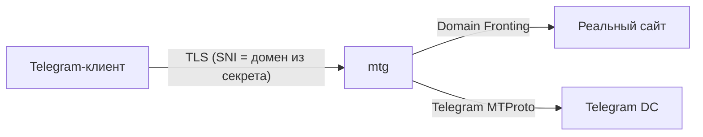

# MTProto‑прокси (mtg)

## Основы

**MTProto** — протокол, используемый Telegram-клиентом для связи с серверами.  
**mtg** ([9seconds/mtg](https://github.com/9seconds/mtg)) — легковесный прокси, который притворяется обычным HTTPS-сайтом (FakeTLS / domain fronting). Это помогает обходить блокировки без использования VPN.

Принцип работы:



- Если запрос выглядит как обычный HTTPS, mtg перенаправляет его на реальный сайт (домен из секрета).
- Если это MTProto‑подключение, mtg проксирует его на серверы Telegram.

Ключевой элемент — **секрет** (secret), в котором закодирован домен для маскировки. Домен должен реально существовать и отвечать на HTTPS.
<!-- more -->
### Режимы запуска

| Режим | Конфигурация | Гибкость | Типичное применение |
|-------|-------------|----------|---------------------|
| `simple-run` | Флаги командной строки | Ограничена | Быстрый запуск, один домен, нет требований к SNI‑IP соответствию |
| `run` (config.toml) | TOML-файл | Полный контроль | Тонкая настройка, явный domain fronting, диагностика через `mtg doctor` |

В `run`‑режиме можно задать:
- Отдельный IP/порт для фронта (не зависящий от домена в секрете)
- Лимит параллельных соединений (`concurrency`)
- Предпочтение IPv4/IPv6
- SOCKS5‑прокси для исходящих

## Базовое развёртывание (simple-run)

Актуальный образ: `nineseconds/mtg:2` (на момент написания `v2.2.8`).

### 1. Генерация секрета

```bash
# Вместо example.com — живой домен, который резолвится с сервера
docker run --rm nineseconds/mtg:2 generate-secret --hex example.com
```

Полученную hex‑строку используем как `MTG_SECRET`.

### 2. docker-compose.yml

```yaml title="/opt/mtproto-proxy/docker-compose.yml"
services:
  mtproxy:
    image: nineseconds/mtg:2
    container_name: mtproto-proxy
    restart: unless-stopped
    ports:
      - "0.0.0.0:443:443"
    command: >
      simple-run
      0.0.0.0:443
      ${MTG_SECRET}
```

Файл `.env`:

```ini title="/opt/mtproto-proxy/.env"
MTG_SECRET=ee...           # секрет, полученный на предыдущем шаге
```

### 3. Запуск

```bash
cd /opt/mtproto-proxy
docker compose up -d
docker logs mtproto-proxy
```

**Примечание:** если сервер не может подключиться к Telegram напрямую (блокировка провайдера), необходимо направить трафик через SOCKS5‑прокси (см. [SOCKS5 через SSH](../../Linux/ssh-socks.md)). Тогда `command` дополнится флагом `-s socks5://127.0.0.1:1080`, а контейнер запускается с `network_mode: host`.

## Продвинутое развёртывание (run + config.toml)

Ниже две схемы с явным управлением domain fronting, SNI‑DNS‑IP соответствием и защитой от self‑dial (петли). Обе используют `run` с файлом `config.toml`.

### Схема 1: domain fronting через sslip.io

Использует публичный wildcard‑DNS сервис [sslip.io](https://sslip.io/), позволяющий получить SNI, совпадающий с IP прокси, без покупки домена.

**Ключевая особенность:** domain fronting настроен на **внешний** IP (чужой хост), не совпадающий с IP прокси — это исключает самозамыкание.

<details>
<summary>docker-compose.yml</summary>

```yaml title="/opt/mtproto-proxy/docker-compose.yml"
services:
  mtproxy:
    image: nineseconds/mtg:2
    container_name: mtproto-proxy
    restart: unless-stopped
    network_mode: host
    volumes:
      - ./config.toml:/config.toml:ro
    command: run /config.toml
```
</details>

<details>
<summary>config.toml</summary>

```toml title="/opt/mtproto-proxy/config.toml"
# Секрет генерируется на домен sslip.io
# docker run --rm nineseconds/mtg:2 generate-secret <IP>.sslip.io
secret = "ee..."

bind-to = "0.0.0.0:443"

# Строго до любых [section] — иначе проигнорируется
prefer-ip = "only-ipv4"

# Явный публичный IP (чтобы mtg не ходил к ifconfig.co)
public-ipv4 = "<ПУБЛИЧНЫЙ_IP>"

# Лимит параллельных соединений
concurrency = 1024

# Domain fronting: ВНЕШНИЙ IP (не IP прокси, не 127.0.0.1)
[domain-fronting]
ip = "<ВНЕШНИЙ_IP_САЙТА>"
port = 443

# Исходящий трафик через SOCKS5
[network]
proxies = ["socks5://127.0.0.1:1080"]
```

</details>

**Запуск и проверка:**

```bash
cd /opt/mtproto-proxy
docker compose pull
docker compose down && docker compose up -d

# Самодиагностика
docker exec mtproto-proxy /mtg doctor /config.toml

# Ссылки для клиентов
docker exec mtproto-proxy /mtg access /config.toml
```

**Примечания:**

- **TOML порядок:** `prefer-ip` и `concurrency` должны быть **до** `[domain-fronting]` и `[network]`. Иначе mtg молча отнесёт их к последней секции и проигнорирует.
- **Self‑dial петля:** если `domain-fronting.ip` равен публичному IP прокси, mtg начнёт слать пробросные соединения сам себе — образуется шквал рекурсивных подключений. Лечится либо правильным IP фронта, либо iptables‑правилом `REJECT` на свой же IP:443.
- **Диагностика петли:** `ss -Htn state established | grep '<ПУБЛИЧНЫЙ_IP>:443'`. ESTAB в сотнях — петля.
- **SNI‑DNS match:** домен `<IP>.sslip.io` резолвится в IP прокси — DPI видит совпадение.

### Схема 2: domain fronting через локальный nginx с собственным wildcard‑сертификатом

Использует собственный домен с A‑записью на IP прокси и wildcard‑сертификат, предъявляемый локальным nginx. Пробросный трафик замыкается внутри хоста (`127.0.0.1:8443`).

**Требования:**
- Собственный домен (`<subdomain>.<domain>.com`)
- A-запись с поддомена на публичный IP прокси
- Wildcard-сертификат (`*.domain.com`), файлы `fullchain.pem` и `privkey.pem`

**Nginx:** слушает `127.0.0.1:8443`, отвечает `204 No Content` с валидным TLS.

```nginx title="/etc/nginx/sites-available/mtg-fronting"
server {
    listen 127.0.0.1:8443 ssl;
    server_name <subdomain>.<domain>.com;

    ssl_certificate     /etc/ssl/mtg/fullchain.pem;
    ssl_certificate_key /etc/ssl/mtg/privkey.pem;

    return 204;
}
```

```bash
sudo ln -sf /etc/nginx/sites-available/mtg-fronting /etc/nginx/sites-enabled/
sudo nginx -t && sudo systemctl reload nginx
ss -tlnp | grep 8443  # убедиться, что слушает
```

<details>
<summary>config.toml</summary>

```toml title="/opt/mtproto-proxy/config.toml"
# Секрет генерируется на поддомен
# docker run --rm nineseconds/mtg:2 generate-secret <subdomain>.<domain>.com
secret = "ee..."

bind-to = "0.0.0.0:443"
prefer-ip = "only-ipv4"

# Fronting замыкается на локальный nginx — петля исключена
[domain-fronting]
ip = "127.0.0.1"
port = 8443

[network]
proxies = ["socks5://127.0.0.1:1080"]
```
</details>

<details>
<summary>docker-compose.yml (тот же, что в схеме 1)</summary>

```yaml title="/opt/mtproto-proxy/docker-compose.yml"
services:
  mtproxy:
    image: nineseconds/mtg:2
    container_name: mtproto-proxy
    restart: unless-stopped
    network_mode: host
    volumes:
      - ./config.toml:/config.toml:ro
    command: run /config.toml
```
</details>

**Запуск и проверка:**

```bash
cd /opt/mtproto-proxy
docker compose pull
docker compose down && docker compose up -d
docker exec mtproto-proxy /mtg doctor /config.toml
docker exec mtproto-proxy /mtg access /config.toml
```

**Примечания:**

- **Безопасность wildcard:** сертификат `*.domain.com` можно копировать на неограниченное число серверов. Файлы ключа должны иметь права `600` и владельца `root`.
- **Петля отсутствует:** fronting на `127.0.0.1` исключает hairpin NAT и рекурсивные соединения.
- **Сравнение со схемой 1:** обе схемы устойчивы к DPI, но используют разные внешние сервисы (sslip.io vs свой домен), что увеличивает общую отказоустойчивость.

## Траблшутинг concurrency

Параметр `concurrency` в mtg задаёт **жёсткий лимит** на количество одновременных ESTABLISHED‑соединений (клиентских и пробросных). При достижении порога прокси перестаёт принимать новые TCP‑соединения на порту — легитимные клиенты получают таймаут соединения. Это не graceful‑degradation, а аварийный «клапан», ограничивающий blast radius при DPI‑пробросах.

### Симптомы превышения лимита

| Уровень | Что наблюдает клиент/администратор |
|--------|-------------------------------------|
| TCP handshake | `SYN` уходит, `SYN-ACK` не приходит → `Connection timed out` |
| Telegram-клиент | Бесконечный спиннер «Connecting...», fallback на другие DC/прокси |
| Логи mtg | Тишина по новым соединениям — они не доходят до уровня приложения |

### Диагностика

```bash
# Общее число ESTABLISHED на порту 443
ss -Htn state established '( sport = :443 or dport = :443 )' | wc -l

# Топ удалённых IP — позволяет отличить клиентов от DPI‑пробросов
ss -Htn state established '( sport = :443 )' \
  | awk '{print $5}' | cut -d: -f1 \
  | sort | uniq -c | sort -nr | head -20

# Проверка на self‑dial петлю (для схемы с sslip.io)
ss -Htn state established '( dport = :443 )' \
  | grep -c '<ПУБЛИЧНЫЙ_IP_ПРОКСИ>'

# Динамика числа соединений каждые 2 секунды
watch -n 2 "ss -Htn state established '( sport = :443 )' | wc -l"
```

### Интерпретация паттернов

| Паттерн в ss | Что это |
|-------------|---------|
| 1–2 соединения с IP | Легитимный клиент |
| Десятки соединений с одного IP | DPI‑пробинг или агрессивный клиент |
| Сотни уникальных IP | Распределённый DPI‑пробинг |
| Собственный публичный IP в исходящих | Self‑dial петля (см. схему 1) |

### Действия в зависимости от причины

| Причина | Решение |
|---------|---------|
| Честная нагрузка > `concurrency` | Поднять лимит до `4096`–`8192` |
| Шквал DPI‑пробросов | **Уменьшить** `concurrency` до `512` — сократить blast radius; пробросы не висят долго, а легитимные клиенты успевают занять освободившиеся слоты |
| Self‑dial петля | Исправить `[domain-fronting]` + iptables‑страховка (см. схему 1) |
| Нехватка CPU/memory VM | Поднятие `concurrency` не поможет — увеличить ресурсы инстанса |

**Важно:** `concurrency` — аварийный клапан, а не способ поднять пропускную способность. Если лимит регулярно выбирается — нужно искать и устранять причину, а не бездумно поднимать цифру.

---

**Источники:**

- [Docker Hub: nineseconds/mtg](https://hub.docker.com/r/nineseconds/mtg)
- [GitHub: 9seconds/mtg](https://github.com/9seconds/mtg)
