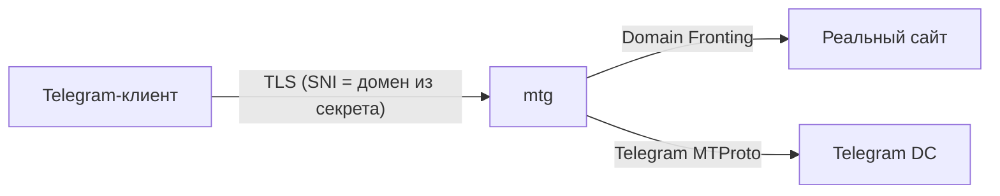

# MTProto‑прокси (mtg)

## Основы

**MTProto** — протокол, используемый Telegram-клиентом для связи с серверами.  
**mtg** ([9seconds/mtg](https://github.com/9seconds/mtg)) — легковесный прокси, который притворяется обычным HTTPS-сайтом (FakeTLS / domain fronting). Это помогает обходить блокировки без использования VPN.

Принцип работы:



- Если запрос выглядит как обычный HTTPS, mtg перенаправляет его на реальный сайт (домен из секрета).
- Если это MTProto‑подключение, mtg проксирует его на серверы Telegram.

Ключевой элемент — **секрет** (secret), в котором закодирован домен для маскировки. Домен должен реально существовать и отвечать на HTTPS.
<!-- more -->
## Развёртывание mtg (v2)

Актуальный образ: `nineseconds/mtg:2` (на момент написания `v2.2.8`).

### 1. Генерация секрета

```bash
# Вместо example.com — живой домен, который резолвится с сервера
docker run --rm nineseconds/mtg:2 generate-secret --hex example.com
```

Полученную hex‑строку используем как `MTG_SECRET`.

### 2. docker-compose.yml

```yaml title="/opt/mtproto-proxy/docker-compose.yml"
services:
  mtproxy:
    image: nineseconds/mtg:2
    container_name: mtproto-proxy
    restart: unless-stopped
    ports:
      - "0.0.0.0:443:443"
    command: >
      simple-run
      0.0.0.0:443
      ${MTG_SECRET}
```

Файл `.env`:

```ini title="/opt/mtproto-proxy/.env"
MTG_SECRET=ee...           # секрет, полученный на предыдущем шаге
```

### 3. Запуск

```bash
cd /opt/mtproto-proxy
docker compose up -d
docker logs mtproto-proxy
```

**Примечание:** если сервер не может подключиться к Telegram напрямую (блокировка провайдера), необходимо направить трафик через SOCKS5‑прокси (см. [SOCKS5 через SSH](../../Linux/ssh-socks.md)). Тогда `command` дополнится флагом `-s socks5://127.0.0.1:1080`, а контейнер запускается с `network_mode: host`.

---

**Источники:**

- [Docker Hub: nineseconds/mtg](https://hub.docker.com/r/nineseconds/mtg)
- [GitHub: 9seconds/mtg](https://github.com/9seconds/mtg)
