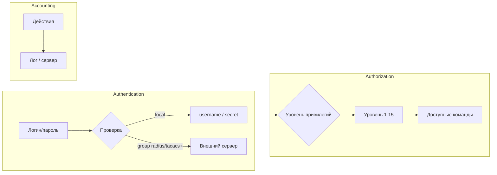

# AAA (IOS XE)

## Терминология

### AAA (Authentication, Authorization, Accounting)

**AAA** — фреймворк Cisco, разделяющий три функции управления доступом:

- **Authentication** — проверка подлинности (кто?). Пользователь предъявляет логин/пароль, AAA решает, принять его или отклонить.
- **Authorization** — разрешение действий (что можно?). После аутентификации AAA определяет, какие команды и ресурсы доступны пользователю.
- **Accounting** — учёт (что сделал?). Запись действий пользователя в лог или на RADIUS/TACACS+ сервер.


<!-- more -->
### AAA new-model

Команда `aaa new-model` — глобальный переключатель. После её включения **все** линии (VTY, консоль, AUX) начинают работать через AAA-методы. Старые команды вида `login local` на линиях могут игнорироваться — необходимо явно привязать метод-листы AAA.

**Важно:** `aaa new-model` применяется к текущей сессии **не сразу**, а при следующем входе. Это даёт возможность дописать метод-листы, не теряя доступ.

### Метод-листы (Method Lists)

Метод-лист — последовательность источников проверки в порядке приоритета. Создаётся командой `aaa <тип> login <имя> <метод1> <метод2> ...`.

**Типы метод-листов:**

- `authentication login` — аутентификация (проверка логина/пароля).
- `authorization exec` — авторизация EXEC-сессии (определение уровня привилегий при входе).
- `authorization commands <0|1|15>` — авторизация отдельных команд (не используется с локальной БД).
- `accounting exec` — учёт EXEC-сессий.

**Доступные методы (для локальной аутентификации):**

| Метод | Описание |
|:---|---|
| `local` | Локальная БД пользователей (`username … secret …`) |
| `local-case` | То же, но с учётом регистра логина |
| `enable` | Пароль `enable password` |
| `none` | Без проверки (опасно, только для тестов) |
| `group radius` | RADIUS-сервер |
| `group tacacs+` | TACACS+-сервер |

Метод-лист `default` применяется ко всем линиям, если не указан явный.

### Privilege Levels (уровни привилегий)

Уровни привилегий — встроенный механизм авторизации Cisco. Каждой команде можно присвоить уровень доступа (1–15). Пользователю при входе назначается уровень, и он может выполнять только команды с уровнем ≤ своего.

| Уровень | Описание |
|:---|---|
| 1 | Пользовательский — `show`, `ping`, `telnet` и т.п. |
| 2–14 | Промежуточные — настраиваются администратором |
| 15 | Привилегированный — полный доступ (`configure terminal`, `reload`, `debug`, все `show`) |

По умолчанию:
- Пользователи без `privilege` в `username` получают уровень 1.
- Пользователи с `privilege 15` получают полный доступ.

### VTY и привязка AAA

Для каждой VTY-линии можно задать:

- `login authentication <имя-метод-листа>` — какой метод-лист использовать для аутентификации.
- `authorization exec <имя-метод-листа>` — какой метод-лист использовать для авторизации EXEC (назначения уровня привилегий).

Если метод-лист не указан, используется `default`.

<!-- more -->

## Кейс: Включение AAA с локальной базой пользователей

**Задача:** Активировать AAA на маршрутизаторе с аутентификацией и авторизацией через локальную БД (`username`).

### Подготовка — аварийный предохранитель

Перед любыми изменениями, затрагивающими механизмы аутентификации, установите таймер автоматической перезагрузки. Если в процессе настройки вы потеряете доступ, маршрутизатор перезагрузится через 10 минут и восстановит последнюю сохранённую конфигурацию.

```cisco
write memory
reload in 10
```

**Важно:** После успешной проверки доступа не забудьте отменить таймер командой `reload cancel`.

### Включение AAA и метод-листы default

```cisco
aaa new-model
aaa authentication login default local
aaa authorization exec default local
```

**Порядок важен:** сначала включаем модель, не прерывая текущую сессию, и сразу прописываем `default` методы. Пока пользователь `default` не задан, новый SSH-вход будет отвергнут.

### Обновление привязок на VTY-линиях

После включения AAA старая команда `login local` на линиях может не работать. Явно укажите метод-листы `default`:

```cisco
line vty 0 4
 login authentication default
 authorization exec default
!
line vty 5 30
 login authentication default
 authorization exec default
```

**Примечание:** Если на линиях ранее была команда `login` без `local`, она запрашивала line password. После включения AAA это поведение переопределяется новыми метод-листами.

### Проверка доступа (критический шаг)

**Не закрывая текущую сессию**, откройте новое SSH-подключение под существующими административными учётками. Если заходит — всё в порядке, таймер можно сбросить.

```cisco
reload cancel
```

Если доступ потерян, у вас ещё есть активная сессия для отката или вы можете дождаться автоматической перезагрузки.

### Верификация

```cisco
show aaa user
show aaa method-lists
show privilege
```

## Кейс: Создание пользователя с ограниченными правами (read-only, privilege level 5)

**Задача:** Создать учётную запись, которая может подключиться по SSH, выполнять `show running-config` и основные диагностические команды, но не имеет доступа к привилегированным командам и режиму конфигурации. Актуально для внешних систем мониторинга или резервного копирования.

### Создание пользователя

```cisco
username mon_user privilege 5 secret <hash>
```

### Разрешение необходимых команд уровня 5

```cisco
privilege exec level 5 show running-config view full
```

### Разрешение доступа к файлам конфигурации

```cisco
file privilege 5
```

**Примечание:** Команда `file privilege 5` доступна не во всех версиях IOS XE. Проверить поддержку можно через `file privilege ?` в режиме конфигурации. Без неё пользователь уровня 5 не сможет прочитать `system:running-config`, даже если команда `show running-config` разрешена.

### Верификация

```cisco
! Проверка уровня привилегий
show privilege

! Проверка доступа к командам
terminal length 0
terminal width 512
show running-config | include hostname

! Проверка, что нет доступа к configure
configure terminal
% Access denied
```

## Диагностика AAA

```cisco
! Текущие AAA-сессии
show aaa user

! Метод-листы в работе
show aaa method-lists

! Пользователи локальной БД
show running-config | section username

! Привязки к линиям
show running-config | section line vty

! Отладка аутентификации (с осторожностью!)
debug aaa authentication

! Отладка авторизации
debug aaa authorization
```

**Важно:** `debug aaa` генерирует большой объём сообщений на консоль и syslog. Включайте только при необходимости и отключайте сразу после диагностики.

## Источники

- [Cisco: Configuring Local Authentication and Authorization (IOS XE 17.x)](https://www.cisco.com/c/en/us/td/docs/switches/lan/catalyst9300/software/release/17-15/configuration_guide/sec/b_1715_sec_9300_cg/configuring_local_authentication_and_authorization.html) — базовая настройка AAA с локальной БД (синтаксис универсален для 15.x–17.x)
- [Cisco Community: Configuring Privilege Levels in Cisco IOS](https://community.cisco.com/t5/networking-knowledge-base/configuring-privilege-levels-in-cisco-ios/ta-p/3119029) — примеры настройки privilege levels и ограничения команд