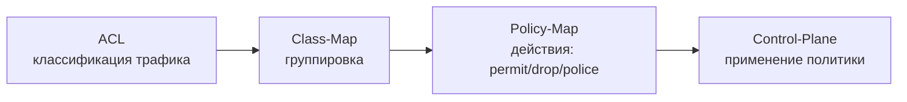

# Control Plane Policing (CoPP)

## Назначение

CoPP — механизм защиты control plane от DoS-атак и избыточного трафика.
Позволяет ограничить или заблокировать нежелательный трафик **до** того, 
как он достигнет CPU устройства.

## Где применяется

- Защита SNMP от несанкционированных опросов
- Ограничение SSH/TELNET доступа
- Фильтрация ICMP
- Защита routing protocols (BGP, OSPF)

## Базовая архитектура



## Пример: блокировка SNMP от недоверенных хостов

### Шаг 1: Классификация трафика

```cisco
ip access-list extended SNMP-UNTRUSTED
  deny   udp host <NMS_IP> any eq snmp    # разрешённый NMS
  permit udp any any eq snmp               # остальной SNMP блокируем
```

### Шаг 2: Создание class-map

```cisco
class-map match-all COPP-DROP-SNMP
  match access-group name SNMP-UNTRUSTED
```

### Шаг 3: Политика с действием drop

```cisco
policy-map COPP-POLICY
  class COPP-DROP-SNMP
    police 8000 conform-action drop exceed-action drop
```

### Шаг 4: Применение к control-plane

```cisco
control-plane
  service-policy input COPP-POLICY
```

## Trade-offs

| Аспект | Риск |
|--------|------|
| Порядок ACL | `deny` в ACL означает «разрешить» для CoPP-политики |
| Производительность | CoPP обрабатывается в software, но до CPU — минимальный оверхед |
| Отладка | Рекомендуется `permit` в ACL с логированием перед внедрением `drop` |

## Рекомендации

1. **Тестируйте в lab** — ошибка в CoPP может заблокировать management-доступ
2. **Начинайте с `transmit`** — используйте `police ... conform-action transmit exceed-action drop` для мягкого внедрения
3. **Документируйте NMS-сервера** — всегда явно перечисляйте доверенные IP

## Полезные команды

```bash
show policy-map control-plane           # применённые политики
show access-lists SNMP-UNTRUSTED        # счётчики ACL
```
