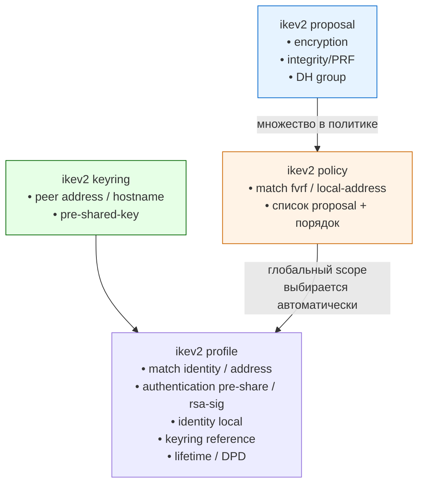
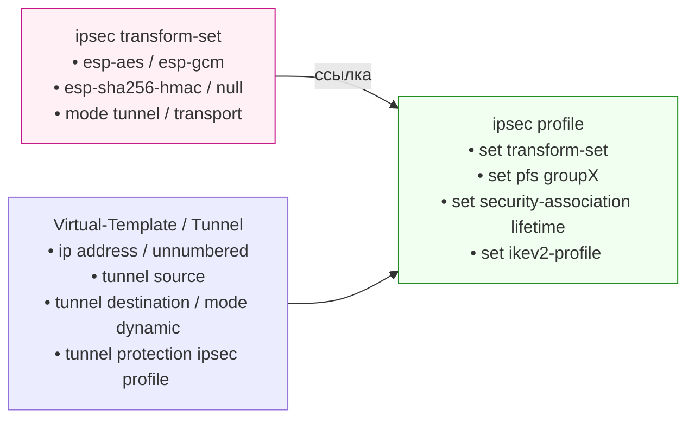

# IPsec VPN на Cisco IOS-XE (IKEv2)

## Общая архитектура компонентов

### Control Plane — IKEv2



### Data Plane — IPsec



## Последовательность настройки (рекомендуемый порядок)

1. **ikev2 proposal** — определяем крипто-алгоритмы (можно переиспользовать)
2. **ikev2 policy** — задаём match-условия и упорядоченный список proposal  
   > Важно: более специфичная политика (например, с `match local-address`) имеет приоритет
3. **ikev2 keyring** — пары peer → PSK (или сертификаты)
4. **ikev2 profile** — основной блок сопоставления, аутентификации, DPD, lifetime  
   > Обязательно указать `match identity remote` и `authentication`
5. **ipsec transform-set** — алгоритмы шифрования и целостности для фазы 2
6. **ipsec profile** — связывает transform-set, PFS, lifetime и **обязательно** ikev2-profile
7. **интерфейс Tunnel** — `tunnel protection ipsec profile <имя>`

> **Примечание**: transform-set, proposal и policy можно (и нужно) переиспользовать между несколькими туннелями.

## Полезные команды отладки

```bash
show crypto ikev2 sa
show crypto ipsec sa
show crypto ikev2 profile
show crypto ikev2 policy
debug crypto ikev2
```
