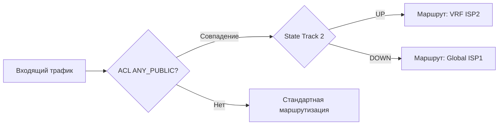

# NAT + PBR с автоматическим переключением между провайдерами (VRF/Global)

## Теоретическая часть: термины и модель

**Задача:**  
Маршрутизатор Cisco ASR1k (IOS XE) с двумя провайдерами:

- **ISP1** — в **глобальной** VRF (default).
- **ISP2** — в отдельной VRF (`ISP2_INTERNET`).

Необходимо организовать выход **клиентов, подключённых к маршрутизатору**, в интернет через любого из провайдеров с автоматическим переключением при отказе активного канала.

**Выбор интерфейса для PBR:**  
PBR (`ip policy route-map …`) навешивается **на входящий интерфейс**, откуда приходит трафик, который нужно маршрутизировать через определённого провайдера. Это может быть:

- туннельный интерфейс (VTI, GRE, DMVPN),
- SVI, под которым сидят хосты,
- физический порт (например, транк к коммутатору).

<!-- more -->
**Ключевые компоненты:**

- **IP SLA** — мониторинг доступности внешнего ресурса (ICMP Echo).
- **Track** — отслеживание состояния SLA для использования в PBR.
- **Policy-Based Routing (PBR)** — задание маршрута для трафика на основе ACL.
- **`set ip vrf ... next-hop verify-availability`** — проверка доступности next-hop в заданном VRF перед применением PBR.
- **NAT Overload (PAT)** — трансляция внутренних адресов в публичные IP каждого провайдера (по одному правилу на провайдера).

**Логика (пример VRF primary):**




---

## Практическая часть

### Общий шаблон конфигурации

**1. ACL для выделения интернет-трафика**

```bash
! ACL, который разрешает только публичные IP-адреса, исключая:
! - мультикаст (224.0.0.0/4)
! - RFC1918 (10.0.0.0/8, 172.16.0.0/12, 192.168.0.0/16)
ip access-list extended ANY_PUBLIC
 deny   ip any 224.0.0.0 15.255.255.255
 deny   ip any 10.0.0.0 0.255.255.255
 deny   ip any 172.16.0.0 0.15.255.255
 deny   ip any 192.168.0.0 0.0.255.255
 permit ip any any
```

**2. ACL для NAT (внутренние сети, которые подлежат трансляции)**

```bash
ip access-list extended PAT
 deny   ip any 10.0.0.0 0.255.255.255
 deny   ip any 172.16.0.0 0.15.255.255
 deny   ip any 192.168.0.0 0.0.255.255
 permit ip 10.156.0.0 0.0.255.255 any
```

**3. IP SLA и Track для каждого провайдера**

Для ISP1 (global):

```bash
ip sla 1
 tag ISP1-global-1.1.1.1-ping
 icmp-echo 1.1.1.1 source-interface <интерфейс_ISP1>
 threshold 1000
 timeout 1000
 frequency 10
ip sla schedule 1 life forever start-time now

track 1 ip sla 1 reachability
 delay down 30 up 60
```

Для ISP2 (VRF):

```bash
ip sla 2
 tag ISP2-VRF-1.1.1.1-ping
 icmp-echo 1.1.1.1 source-interface <интерфейс_ISP2>
 vrf ISP2_INTERNET
 threshold 1000
 timeout 1000
 frequency 10
ip sla schedule 2 life forever start-time now

track 2 ip sla 2 reachability
 delay down 30 up 60
```

**4. NAT Overload (PAT)**

```bash
ip nat inside source list PAT interface <интерфейс_ISP1> overload
ip nat inside source list PAT interface <интерфейс_ISP2> vrf ISP2_INTERNET overload
```

**5. Обратный маршрут в VRF для возвратного трафика**

```bash
! Позволяет пакетам, которые вернулись из интернета через ISP2 (VRF),
! после де‑NAT попасть в глобальную таблицу по направлению к получателям.
ip route vrf ISP2_INTERNET 10.156.0.0 255.255.0.0 <next-hop-to-global> global
```

Замените `<next-hop-to-global>` на адрес маршрутизатора или коммутатора, который находится в глобальной таблице и знает о внутренних сетях.

**6. Применение PBR**

Выберите интерфейс, на который приходит клиентский трафик (например, `Tunnel0`, `Vlan100`, `GigabitEthernet0/0/1`). На нём:

```bash
interface <внутренний_интерфейс>
 ip policy route-map INTERNET-FAILOVER
```

---

### Кейс 1. ISP2 (VRF) — основной, ISP1 (Global) — резервный

```bash
route-map INTERNET-FAILOVER permit 10
 match ip address ANY_PUBLIC
 set ip vrf ISP2_INTERNET next-hop verify-availability <gw-ISP2> 2 track 2
!
route-map INTERNET-FAILOVER permit 20
! fallback — ничего не меняем, трафик пойдёт по глобальной таблице (ISP1)
```

- `verify-availability` — при недоступности ISP2 (track 2 down) PBR переходит к `permit 20`, который оставляет маршрутизацию на усмотрение глобальной таблицы (ISP1).

---

### Кейс 2. ISP1 (Global) — основной, ISP2 (VRF) — резервный

```bash
route-map INTERNET-FAILOVER permit 10
 match ip address ANY_PUBLIC
 set ip next-hop verify-availability <gw-ISP1> 1 track 1
!
route-map INTERNET-FAILOVER permit 20
 match ip address ANY_PUBLIC
 set ip vrf ISP2_INTERNET next-hop <gw-ISP2>
!
route-map INTERNET-FAILOVER permit 30
! catch-all — всё остальное (внутреннее, мультикаст) в global
```

- При недоступности ISP1 (track 1 down) применяется правило `permit 20` и трафик направляется через ISP2 в VRF.
- Если оба провайдера недоступны, последнее правило (`permit 30`) ничего не меняет — трафик уходит в глобальный default, который может быть мёртв. Для полной защиты можно добавить `set interface Null0`.

---

### Проверка работоспособности

```bash
show ip sla summary
show track brief
show route-map INTERNET-FAILOVER
show ip nat translations vrf ISP2_INTERNET
```

---

**Источники:**

- [Cisco IOS 15.5M&T — PBR Next-Hop Verify Availability for VRF](https://www.cisco.com/c/en/us/td/docs/ios-xml/ios/iproute_pi/configuration/15-mt/iri-15-mt-book/iri-pbr-next-hop-verify-availability-for-vrf.html)
- [Configure Policy-based Routing with Next-Hop Commands — Cisco](https://www.cisco.com/c/en/us/support/docs/ip/ip-routed-protocols/47121-pbr-cmds-ce.html)