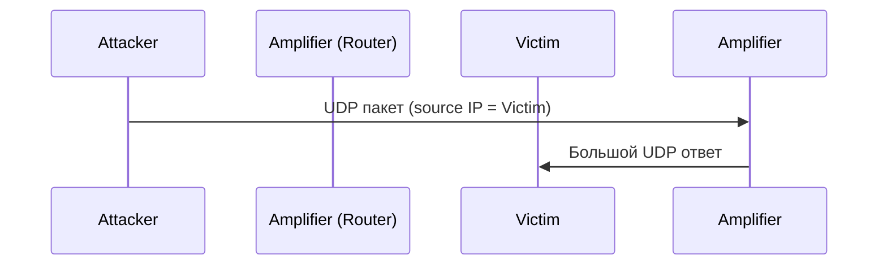

# Харденинг Cisco 7200 (IOS 12)

## Терминология и основы

### DDoS-амплификация и reflector

**Reflector (амплификатор)** — сервис, который на маленький поддельный UDP-запрос отвечает существенно бо́льшим ответом, направляемым на IP-адрес жертвы (spoofed source). Используется протокол UDP, так как он не требует установки соединения.

Коэффициент усиления у некоторых сервисов достигает 350:1.



### CHARGEN (Character Generator)

- Порт: 19 UDP/TCP (RFC 864).
- На каждый входящий пакет отвечает непрерывным потоком случайных символов.
- Один из самых мощных DDoS-амплификаторов (коэффициент до 350:1).
- В Cisco IOS включается глобальной командой `service udp-small-servers` (и `tcp-small-servers`).
<!-- more -->
### SNMP как амплификатор

- Порт: 161 UDP.
- SNMPv1/v2c с известным community (например, `public`) позволяет получить большой объём данных в ответ на один запрос.
- Амплификация через `GetBulk`, особенно при `snmp-server ifindex persist` и больших таблицах интерфейсов.

### PPTP и TCP

PPTP (TCP/1723) и другие TCP-сервисы **не могут быть классическими UDP-амплификаторами**, так как TCP требует трёхстороннего рукопожатия, а подделать IP-адрес жертвы для полноценного handshake невозможно.

<!-- more -->

---

## Отключение small-servers

### Диагностика

```cisco
show running-config | include small-servers
show control-plane host open-ports | i LISTEN
show udp | include 19|7|9|13
```

**Примечание:** Команда `show ip sockets` на IOS 12.4(24)T5 может отсутствовать. Альтернатива — `show udp` и `show tcp brief all`.

### Отключение

```cisco
conf t
no service udp-small-servers   ! CHARGEN, Echo, Discard, Daytime (UDP)
no service tcp-small-servers   ! те же сервисы по TCP
end
write memory
```

**Важно:**

- Команды **не влияют** на маршрутизацию, PPTP, IPsec и работу текущих клиентов. Это исключительно диагностические службы, оставшиеся с ранних версий IOS.
- После выполнения порты 7, 9, 13, 19 исчезают из вывода `show control-plane host open-ports` и `show udp`.
- Внешнее UDP-сканирование (nmap) покажет для порта 19 состояние `open|filtered` — ответные пакеты отсутствуют, amplification невозможен.

**Источники:**

- [Cisco IOS Configuration Fundamentals Command Reference](https://www.cisco.com/c/en/us/td/docs/ios/fundamentals/command/reference/cf_book.html)
- [Qrator Radar](https://radar.qrator.net/)