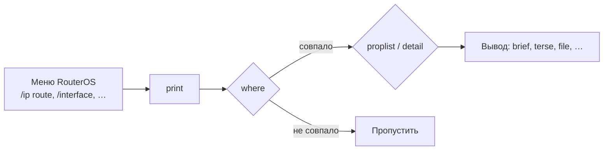

# Команда `print`: фильтры и колонки в RouterOS

## Как устроен `print`

Почти каждое меню RouterOS поддерживает команду `print` — основной инструмент для просмотра, поиска и мониторинга сущностей (интерфейсов, маршрутов, правил файрвола, VPN-пиров и т.д.).

Ключевые параметры, которые можно комбинировать:

| Параметр | Назначение |
|---|---|
| `where` | Фильтрация строк по выражению |
| `proplist` | Точный список выводимых свойств |
| `detail` | Показать **все** свойства каждого элемента |
| `brief` | Компактный табличный вид (по умолчанию) |
| `count-only` | Только количество совпавших записей |
| `from` | Начать вывод с указанного элемента |
| `follow` / `follow-only` | Отслеживание новых/меняющихся записей в реальном времени |
| `interval` | Периодический повтор вывода (секунды) |
| `as-value` | Вывод в виде массива (для скриптов) |
| `terse` | Компактный построчный формат (для парсинга) |
| `value-list` | Каждое значение на отдельной строке |
| `without-paging` | Отключить постраничный вывод |
| `file` | Сохранить вывод в файл |
<!-- more -->


## Синтаксис `where`

Общая форма: **`where <свойство> <оператор> <значение>`**

### Операторы сравнения

| Оператор | Значение |
|---|---|
| `=` | Равно |
| `!=` | Не равно |
| `>` | Больше |
| `<` | Меньше |
| `>=` | Больше или равно |
| `<=` | Меньше или равно |
| `~` | Совпадение с регулярным выражением |
| `!~` | Не совпадение с регулярным выражением |
| `in` | Принадлежность диапазону/подсети |

### Логические операторы

| Оператор | Значение |
|---|---|
| `&&` | Логическое И |
| `\|\|` | Логическое ИЛИ |
| `!` | Логическое НЕ (перед условием) |

### Регулярные выражения

RouterOS использует упрощённый диалект regex (без PCRE):

- `^` — начало строки, `$` — конец строки
- `.` — любой символ
- `.*` — любая последовательность
- `[abc]` — класс символов
- `\d` — цифра (**только в ROS v7+**)

---

## Быстрый вывод с фильтрацией

### Базовый `where`

```bash
# Интерфейсы, которые сейчас отключены
/interface print where disabled=yes

# Все динамические маршруты
/ip route print where dynamic=yes

# Маршруты с конкретным шлюзом
/ip route print where gateway="10.0.1.1"

# Все правила NAT в цепочке dstnat
/ip firewall nat print where chain=dstnat
```

**Важно:** строковые значения с пробелами или спецсимволами — только в двойных кавычках; числовые и `yes`/`no` — без кавычек.

### Регулярные выражения

```bash
# Все интерфейсы, начинающиеся на «ether»
/interface print where name~"^ether"

# Всё, что содержит «bridge» в названии
/interface print where name~"bridge"

# Исключить VLAN-интерфейсы
/interface print where name!~"^vlan"
```

### Логические комбинации

```bash
# Динамические И активные маршруты
/ip route print where dynamic=yes && active=yes

# Интерфейсы ether1 ИЛИ ether2
/interface print where name=ether1 || name=ether2

# Все dstnat-правила, НЕ на порт 443
/ip firewall nat print where chain=dstnat && dst-port!=443
```

### Фильтр с `in` (диапазоны и подсети)

```bash
# Активные соединения из подсети 10.156.0.0/16
/ip firewall connection print where src-address in 10.156.0.0/16

# Соединения, ИСТОЧНИК которых в подсети И есть src-nat
/ip firewall connection print where src-address in 10.156.0.0/16 && src-nat
```

---

## Выбор колонок: `proplist`

По умолчанию `print` показывает фиксированный набор колонок.  
`proplist` позволяет выбрать **конкретные свойства**, включая скрытые.  
Особенно полезно для скриптов, API и экономии места.

```bash
# Только имя, сервис и время последнего выхода (PPP)
/ppp secret print proplist=name,service,last-logged-out

# WireGuard-пиры: имя, client-address, last-handshake
/interface wireguard peers print proplist=name,client-address,last-handshake

# Только имя и disabled для всех интерфейсов
/interface print proplist=name,disabled

# Адрес, шлюз и статус DHCP-клиента
/ip dhcp-client print proplist=interface,address,gateway,status
```

**Важно:** имена свойств чувствительны к регистру. Узнать точные имена можно через `print detail` — первый же элемент покажет все доступные поля.

---

## Комбинирование `where` и `proplist`

Оба параметра отлично работают вместе — можно одновременно фильтровать строки и выбирать нужные колонки.

```bash
# Только имена и статус отключённых интерфейсов
/interface print proplist=name,disabled where disabled=yes

# Имя, client-address и last-handshake для WG-пира с конкретным IP
/interface wireguard peers print proplist=name,last-handshake where client-address=10.0.0.5/32

# Все dstnat-правила: показываем только порт, действие и комментарий
/ip firewall nat print proplist=dst-port,action,comment where chain=dstnat

# Динамические маршруты — только dst-address, шлюз и дистанция
/ip route print proplist=dst-address,gateway,distance where dynamic=yes
```

**Важно:** порядок параметров не имеет значения — `where` после `proplist` или наоборот работает одинаково.

---

## `detail` — все свойства разом

Показывает **каждое** свойство объекта, включая те, что скрыты в обычном `brief`-выводе.

```bash
# Полная информация о всех файлах (тип, размер, версия пакета)
/file print detail

# Все BGP-сессии со всеми атрибутами
/routing bgp session print detail

# Детальная информация по конкретному IP-адресу
/ip address print detail where address="10.0.0.1/24"
```

**Совет:** если не знаете точное имя свойства для `proplist` — сначала посмотрите `print detail` на одном элементе.

---

## `count-only` — только количество

Удобно для проверки масштаба перед массовыми операциями.

```bash
# Сколько всего правил в filter-таблице
/ip firewall filter print count-only

# Сколько активных DHCP-клиентов
/ip dhcp-client print count-only where status=bound

# Сколько динамических записей ARP
/ip arp print count-only where dynamic=yes
```

---

## `from` — сдвиг вывода

Пропускает первые N элементов. Полезно в скриптах и при пагинации.

```bash
# Пропустить первые 10 записей
/ip route print from=10

# Взять строки с 5-й по 14-ю (совместно с where)
/ip arp print from=5 where dynamic=yes
```

Для постраничного просмотра с экрана используйте встроенный пагинатор (по умолчанию), а для скриптов — комбинацию `from` и `without-paging`.

---

## Отслеживание в реальном времени

### `follow` — следить за изменениями

Показывает новые и изменённые записи по мере их появления.  
**Не завершается** — висит до Ctrl+C.

```bash
# Отслеживать новые записи в логе
/log print follow

# Только новые записи (без показа уже существующих)
/log print follow-only

# Отслеживать только сообщения с текстом «failed»
/log print follow-only where message~"failed"
```

### `interval` — периодический повтор

Повторяет полный вывод каждые N секунд (в отличие от `follow`, который показывает только дельту).

```bash
# Обновлять список интерфейсов каждые 2 секунды
/interface print interval=2

# Каждые 5 секунд — количество маршрутов через ether1
/ip route print count-only interval=5 where interface="ether1"
```

**Важно:** `follow` и `interval` несовместимы в одном вызове. Выбирайте:

- `follow` — наблюдение за потоком изменений,
- `interval` — повторение полного снимка.

---

## Сохранение вывода в файл

```bash
# Сохранить полную конфигурацию интерфейсов
/interface print detail file=interfaces.txt

# Сохранить все маршруты таблицы main
/ip route print detail file=routes.txt where routing-table=main
```

Файл сохраняется в памяти роутера. Скачать можно через **WinBox → Files** или по SFTP.

---

## Форматы вывода для скриптов

### `as-value` — массив для парсинга

Возвращает данные в виде массива ключ-значение. Используется **только** внутри скриптов через `:put`.

```bash
# Внутри скрипта: получить массив IP-адресов
:put [/ip address print as-value]
```

### `terse` — по одному элементу на строку

Компактный формат, удобный для `grep`-подобной обработки.

```bash
/interface print terse
```

### `value-list` — каждое свойство на отдельной строке

```bash
/ip address print value-list where interface=ether1
```

---

## Пример из жизни: найти проблемные PPP-сессии

Задача: найти всех PPP-пользователей, которые не выходили на связь больше недели.

```bash
# Шаг 1: смотрим список с last-logged-out
/ppp secret print proplist=name,service,last-logged-out

# Шаг 2: если нужно найти «мёртвые» учётки — сохраняем в файл
/ppp secret print detail file=ppp-audit.txt
```

Задача: найти в логе все сообщения об ошибках BGP за последний час (через `follow`):

```bash
/log print follow-only where message~"BGP.*error"
```

---

## Пример из жизни: аудит активных правил файрвола

Задача: получить все активные правила filter-таблицы в цепочке `forward` с ключевыми полями — компактно, одной строкой.

```bash
# Все активные правила в forward с нужными полями
/ip firewall filter print terse proplist=action,src-address,src-address-list,in-interface,in-interface-list,out-interface,out-interface-list,dst-address,dst-address-list,dst-port,protocol where chain=forward && disabled=no
```

**Совет:** `terse` выводит каждое правило одной строкой — удобно для быстрого аудита или копирования в текстовый отчёт. При необходимости замените `terse` на `detail` для полной картины.

---

## Пример из жизни: NAT-трансляции и Connection Tracking

Задача: посмотреть, кто сейчас «ходит» через NAT, и какие пробросы портов активны.

```bash
# Все активные соединения
/ip firewall connection print

# Только srcnat (маскарад) — кто ходит наружу
/ip firewall connection print where src-nat

# Только dstnat (проброс портов) — что заходит внутрь
/ip firewall connection print where dst-nat

# Все соединения к конкретному хосту назначения
/ip firewall connection print where dst-address=10.0.0.10

# Соединения из подсети источника, которые идут через NAT
/ip firewall connection print where src-address in 10.156.0.0/16 && src-nat

# Статистика срабатываний правил NAT
/ip firewall nat print stats
```

**Важно:** `/ip firewall connection` показывает активные записи connection tracking — они живут, пока есть трафик. После разрыва соединения запись пропадает из вывода.

---

## Источники

- [MikroTik Wiki — Scripting: Print Command Parameters](https://help.mikrotik.com/docs/display/ROS/Scripting)
- [MikroTik Wiki — API Query Syntax](https://help.mikrotik.com/docs/display/ROS/API)
- [MikroTik Wiki — Scripting Tips and Tricks](https://help.mikrotik.com/docs/spaces/ROS/pages/283574370/Scripting+Tips+and+Tricks)