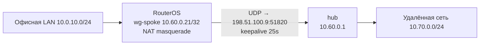
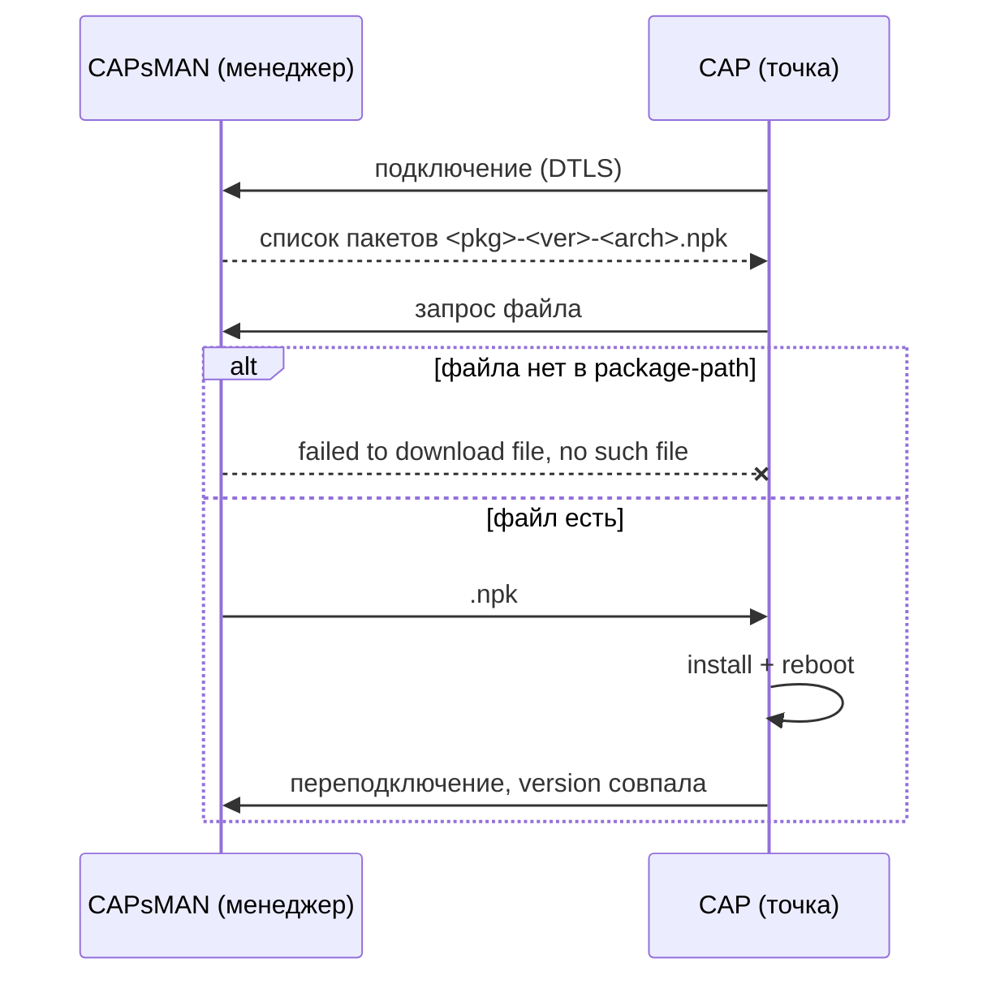

# Mikrotik RouterOS

## IPsec (GRE over IPsec)

В обычной ситуации достаточно создать интерфейс типа GRE Tunnel - всё необходимое будет создаваться автоматически  
Если же это не подходит, например мы хотим включить режим response-only (passive), то при создании интерфейса GRE Tunnel не задаём пароль ipsec и предварительно создаём вручную динамические сущности для тунеля:  

```
/ip ipsec peer
add name=new-peer address=X.X.X.X/32 local-address=Y.Y.Y.Y passive=yes
```
```
/ip ipsec identity
add peer=new-peer auth-method=pre-shared-key secret="ВАШ_PSK"
```
```
/ip ipsec policy
add src-address=Y.Y.Y.Y/32 dst-address=X.X.X.X/32 protocol=gre \
    action=encrypt tunnel=no peer=new-peer proposal=default
```

---
<!-- more -->
## BGP

1. Создаём префикс-листы
    ```
    /routing filter rule
    add chain=bgp-in disabled=no rule=\
        "if ((dst in <принимаемый_префикс>/15) || (dst in <принимаемый_префикс>/15)) { accept }"
    ```
2. Настраиваем нашу ASN
    ```
    /routing bgp template
    set default as=<номер_локальной_asn> disabled=no router-id=<ip_адрес_роутера> routing-table=main
    ```
3. Создаём соединение с соседом
    ```
    /routing bgp connection
    add as=<номер_локальной_asn> disabled=no input.filter=bgp-in local.address=\
        <локальный_тунельный_ip> .role=ebgp name=connection-name output.network=<адрес-лист_анонсируемых_подсетей> \
        remote.address=<тунельный_ip_соесда>/32 .as=<asn_соседа> \
        templates=default
    ```

---

## DNS-based Policy Routing (Geo‑unblock)

Задача: направить трафик к определённым интернет‑ресурсам через альтернативный шлюз (SSTP‑туннель к другому провайдеру), чтобы обойти географические ограничения или блокировки.  
Решение основано на динамическом добавлении IP‑адресов в адрес‑лист при разрешении имён через локальный DNS роутера.

**Схема работы:**

1. Клиент отправляет DNS‑запрос (UDP/53).
2. Правило `dstnat` с действием `redirect` перехватывает запрос и отправляет на локальный DNS‑сервер RouterOS.
3. В `/ip dns static` созданы записи типа `FWD` для нужных доменов с флагом `Match Subdomain` и указанием `address-list`. При резолве роутер добавляет IP‑адрес из ответа в заданный адрес‑лист.
4. Правило `mangle` в цепочке `prerouting` помечает пакеты, у которых `dst-address` входит в этот адрес‑лист, меткой routing‑mark (например, `to-tunnel`).
5. В `/ip route` существует маршрут по умолчанию в таблице `to-tunnel`, указывающий на интерфейс SSTP‑туннеля.
6. Трафик к целевым ресурсам уходит через туннель, остальной трафик идёт через стандартный шлюз.

**Проблема:** устройства домена используют DDNS (RFC 2136) для регистрации своих имён на контроллере домена, посылая DNS UPDATE. Пакеты UPDATE перехватываются тем же `redirect`, но статические записи их не обрабатывают — регистрация ломается.  

**Решение:** с помощью Layer7‑фильтра идентифицировать DNS‑запросы типа `UPDATE` (opcode 5) и пропускать их мимо `redirect`, давая пройти напрямую к контроллеру домена.

### Настройка перенаправления трафика по доменным именам

**Исходные данные (обезличены):**

- Локальный контроллер домена: `10.0.0.10`
- SSTP‑туннель: интерфейс `sstp-out1`, удалённый шлюз `10.255.255.1`
- Целевые домены: `example-geo.com`, `another-blocked.org`
- Адрес‑лист для подмены маршрута: `unblock-hosts`
- Имя маршрутной метки: `to-tunnel`

#### Шаг 1 – DNS Static записи

```bash
/ip dns static
add name=example-geo.com type=FWD forward-to=10.0.0.10 match-subdomain=yes \
    address-list=unblock-hosts comment="Geo-unblock example"
add name=another-blocked.org type=FWD forward-to=10.0.0.10 match-subdomain=yes \
    address-list=unblock-hosts comment="Geo-unblock another"
```

**Важно:** `forward-to` указывает на ваш существующий DNS‑сервер (контроллер домена), который выполняет фактический рекурсивный запрос.

#### Шаг 2 – Mangle правило для маркировки трафика

```bash
/ip firewall mangle
add chain=prerouting dst-address-list=unblock-hosts action=mark-routing \
    new-routing-mark=to-tunnel passthrough=yes \
    comment="Маршрутизация через SSTP для unblock-hosts"
```

#### Шаг 3 – Дополнительная таблица маршрутизации и маршрут по умолчанию через туннель

```bash
/ip route
add dst-address=0.0.0.0/0 gateway=10.255.255.1 routing-table=to-tunnel \
    comment="Default route via SSTP"
```

#### Шаг 4 – Перехват DNS-запросов (redirect)

```bash
/ip firewall nat
add chain=dstnat protocol=udp dst-port=53 action=redirect \
    comment="Redirect DNS to RouterOS local server"
```

После этого трафик к IP‑адресам, которые вернул DNS для `example-geo.com` и `another-blocked.org`, пойдёт через SSTP‑туннель.

### Исключение DNS Dynamic Update из перехвата

**Проблема:** после включения `redirect` доменные устройства не могут зарегистрироваться в DNS на контроллере домена.

**Причина:** пакеты DDNS (тип `UPDATE`, opcode 5) попадают в `redirect` и не обрабатываются статикой.

**Решение:** добавить Layer7‑сигнатуру для `UPDATE` и пропускать такие пакеты до срабатывания `redirect`.

#### Шаг 1 – Создать Layer7 протокол для DNS UPDATE

```bash
/ip firewall layer7-protocol
add name=dns-update regexp="^..[()*+,./-]" comment="Detect DNS UPDATE (opcode 5)"
```

#### Шаг 2 – Разместить разрешающее правило перед redirect

```bash
/ip firewall nat
add chain=dstnat protocol=udp dst-port=53 layer7-protocol=dns-update \
    action=accept comment="Пропуск DDNS UPDATE на DC" \
    place-before=[find where action=redirect protocol=udp dst-port=53]
```

**Результат:** обычные DNS‑запросы по‑прежнему заворачиваются на локальный DNS роутера и пополняют адрес‑лист, а обновления DDNS прозрачно доходят до контроллера домена.

**Источники:**
- [MikroTik Wiki: Layer7](https://help.mikrotik.com/docs/display/ROS/Layer7)
- [RFC 2136 – Dynamic Updates in the Domain Name System](https://datatracker.ietf.org/doc/html/rfc2136)

---

## WireGuard (гостевой доступ с белым списком)

Каждый экземпляр WireGuard на роутере слушает **свой UDP‑порт** и изолирован от других интерфейсов.  
Для гостей/подрядчиков заводят выделенный интерфейс, чтобы:

- не смешивать их трафик с сотрудниками и облачным доступом,
- управлять белым списком через отдельную цепочку firewall,
- при необходимости быстро отключить всю гостевую подсеть одним правилом.

Каждому гостю выделяется **персональный IP с маской /32** — запрещает подмену source‑IP внутри туннеля.  
Разрешённые ресурсы описываются **адрес‑листами**, что упрощает добавление новых гостей (один peer + правило под новый source‑IP без дублирования dst‑адресов).

### Настройка гостевого WireGuard‑сервера (RDP-доступ подрядчику)

**Исходные данные (обезличены):**

- Публичный IP роутера: `198.51.100.1`
- Гостевая WireGuard-подсеть: `10.255.250.0/24`
- Выбранный порт: `13232` (должен отличаться от портов других WireGuard-интерфейсов)
- Целевой RDP-сервер: `192.168.100.5`
- DNS-сервер для гостей: `192.168.100.1`
- WAN-интерфейс: `ether1`

#### Шаг 1 – Создание интерфейса и назначение IP

```bash
/interface wireguard
add name=wg-guests listen-port=13232 comment="Guest WG server"

/ip address
add address=10.255.250.1/24 interface=wg-guests comment="Guest WG subnet"
```

**Важно:** каждая пара ключей (private/public) генерируется автоматически. Посмотреть публичный ключ сервера — `:put [/interface wireguard get wg-guests public-key]`.

#### Шаг 2 – Открытие порта в chain=input

```bash
/ip firewall filter
add action=accept chain=input dst-port=13232 protocol=udp comment="Allow WireGuard guests" place-before=1
```

**Важно:** правило должно оказаться выше всех `drop`-правил в цепочке `input`.

#### Шаг 3 – Address‑листы для разрешённых ресурсов

```bash
/ip firewall address-list
add address=192.168.100.5 list=guest-rdp-servers comment="RDP Terminal Server"
add address=192.168.100.1 list=guest-dns comment="DNS server"
```

#### Шаг 4 – Цепочка guest-fwd и разрешающие правила

```bash
/ip firewall filter
# Прыжок из forward для всей гостевой подсети
add chain=forward src-address=10.255.250.0/24 action=jump jump-target=guest-fwd comment="Jump guest traffic"
```

**Примечание:** цепочка `guest-fwd` создастся автоматически при добавлении этого правила. Отдельно объявлять её (`/ip firewall filter add chain=guest-fwd`) не требуется.

```bash
/ip firewall filter
# Каждый гость — свой комплект разрешений (src-address уникален)
add chain=guest-fwd src-address=10.255.250.11 dst-address-list=guest-rdp-servers protocol=tcp dst-port=3389 action=accept comment="Allow RDP for guest #1"
add chain=guest-fwd src-address=10.255.250.11 dst-address-list=guest-dns protocol=udp dst-port=53 action=accept comment="Allow DNS UDP for guest #1"
add chain=guest-fwd src-address=10.255.250.11 dst-address-list=guest-dns protocol=tcp dst-port=53 action=accept comment="Allow DNS TCP for guest #1"

# В конце цепочки — запрет всего остального
add chain=guest-fwd action=drop comment="Drop all other guest traffic"
```

**Важно:** на каждого следующего гостя добавляется новый peer (см. шаг 5) и аналогичные три правила с его уникальным `src-address`.

#### Шаг 5 – Добавление гостя (peer)

```bash
/interface wireguard peers
add interface=wg-guests \
    public-key="<ПУБЛИЧНЫЙ_КЛЮЧ_КЛИЕНТА>" \
    allowed-address=10.255.250.11/32 \
    comment="Гость Иванов, RDP-доступ"
```

**Важно:** `allowed-address=.../32` жёстко привязывает этого пира к одному IP. Без этого гость может заявить любой адрес из подсети.

#### Шаг 6 – Запрет доступа гостей к самому роутеру

```bash
/ip firewall filter
add action=drop chain=input src-address=10.255.250.0/24 comment="Guests must not access router"
```

**Ограничение:** если гостям нужен DNS‑сервер самого роутера (`10.255.250.1`), разместите разрешающее правило для UDP/53 к `10.255.250.1` выше этого drop.

#### Шаг 7 – (Опционально) NAT для выхода гостей в интернет

```bash
/ip firewall nat
add chain=srcnat src-address=10.255.250.0/24 out-interface=ether1 action=masquerade comment="NAT for guests"
```

Если интернет гостям не нужен — правило не добавляйте.

#### Пример клиентского конфига (выдаётся гостю)

```ini
[Interface]
PrivateKey = <ПРИВАТНЫЙ_КЛЮЧ_КЛИЕНТА>
Address = 10.255.250.11/32
DNS = 192.168.100.1

[Peer]
PublicKey = <ПУБЛИЧНЫЙ_КЛЮЧ_ВАШЕГО_СЕРВЕРА>
Endpoint = 198.51.100.1:13232
AllowedIPs = 10.255.250.0/24, 192.168.100.5/32, 192.168.100.1/32
PersistentKeepalive = 25
```

**Примечание:** `AllowedIPs` на клиенте перечисляет только те подсети/IP, которые вы фактически разрешили в цепочке `guest-fwd`. Клиент не сможет маршрутизировать ничего другого через туннель.

**Источники:**

- [MikroTik Wiki: WireGuard](https://help.mikrotik.com/docs/display/ROS/WireGuard)
- [MikroTik Wiki: Firewall Filter](https://help.mikrotik.com/docs/display/ROS/Filter)
- [MikroTik Wiki: Address Lists](https://help.mikrotik.com/docs/display/ROS/Address-lists)

---

## WireGuard (hub-spoke архитектура: роутер в роли spoke)

Роутер в роли **spoke (инициатор)**: держит приватный ключ и сам устанавливает туннель к удаленному **hub** по заранее известным публичному ключу и endpoint. Публичный ключ роутера при этом должен быть зарегистрирован на hub.



### Настройка spoke (spoke → hub)

#### Шаг 1 – Создание WireGuard‑интерфейса

```bash
/interface wireguard
add name=wg-spoke listen-port=51830 private-key="<ПРИВАТНЫЙ_КЛЮЧ_SPOKE>" \
    comment="S2S client to hub"
```

**Важно:** `listen-port` должен отличаться от портов остальных WireGuard‑интерфейсов роутера.  
**Важно:** при заданном `private-key` публичный ключ выводится из него — сверьте и передайте на hub: `:put [/interface wireguard get wg-spoke public-key]`.

#### Шаг 2 – Назначение IP на интерфейс

```bash
/ip address
add address=10.60.0.21/32 interface=wg-spoke comment="WG transit"
```

#### Шаг 3 – Добавление пира (hub)

```bash
/interface wireguard peers
add interface=wg-spoke \
    public-key="<ПУБЛИЧНЫЙ_КЛЮЧ_HUB>" \
    endpoint-address=198.51.100.9 endpoint-port=51820 \
    allowed-address=10.60.0.0/24,10.70.0.0/24 \
    persistent-keepalive=25s \
    comment="hub"
```

**Важно:** `allowed-address` — это крипто‑фильтр WireGuard (какие адреса принимаем от пира и куда ему направляем трафик), а **не** записи в таблице маршрутизации — см. шаг 4.  
**Важно:** `persistent-keepalive=25s` обязателен, если spoke за NAT — он поддерживает маппинг в stateful‑firewall/NAT.

#### Шаг 4 – Маршруты через WG‑интерфейс

```bash
/ip route
add dst-address=10.60.0.0/24 gateway=wg-spoke comment="Hub transit net"
add dst-address=10.70.0.0/24 gateway=wg-spoke comment="Remote net"
```

**Важно:** в отличие от `wg-quick` (который сам выводит маршруты из `AllowedIPs`), RouterOS маршруты из `allowed-address` **не создаёт** — их добавляют вручную.

#### Шаг 5 – NAT (masquerade) для офисной LAN

```bash
/ip firewall nat
add chain=srcnat src-address=10.0.10.0/24 out-interface=wg-spoke action=masquerade \
    comment="Office LAN -> via wg-spoke"
```

**Примечание:** при NAT hub видит трафик офиса как адрес spoke (`10.60.0.21`) и не нуждается в обратных маршрутах к офисной подсети. Если hub знает маршрут до офисной сети (без NAT) — правило не добавляйте.  
**Ограничение:** возвратный трафик из облака подпадает под существующие `accept established,related`; отдельное правило `chain=input` нужно только если hub обращается к самому роутеру (`10.60.0.21`).

**Проверка:**

```bash
/interface wireguard peers print detail where interface=wg-spoke   # last-handshake, rx/tx
/ping 10.60.0.1
```

**Источники:**

- [MikroTik Manual: WireGuard (интерфейс)](https://manual.mikrotik.com/docs/cli-reference/interface/wireguard/)
- [MikroTik Manual: WireGuard peers](https://manual.mikrotik.com/docs/cli-reference/interface/wireguard/peers/)
- [MikroTik Wiki: WireGuard](https://help.mikrotik.com/docs/display/ROS/WireGuard)

---

## Обновление точек доступа через CAPsMAN (legacy wireless)

CAPsMAN (контроллер `/caps-man`, пакет `wireless`) обновляет CAP'ы, раздавая им `.npk` из своего файлового хранилища. Имя запрашиваемого файла формируется как `<package>-<version>-<architecture>.npk`, где:

- `version` — версия, установленная на менеджере (`/system package update get installed-version`);
- `architecture` — архитектура **точки**, а не менеджера.

Пакеты лежат в каталоге из параметра `package-path`. Если `package-path` пуст, менеджер раздаёт только «встроенные» пакеты — те, что остались в `/file` после собственного апгрейда, и только для CAP'ов **той же архитектуры**. После штатного апгрейда через *Check for updates* RouterOS не оставляет `.npk` в `/file`, поэтому раздавать нечего — в логе появляется:

```
caps,error [...] upgrade status: failed, failed to download file 'wireless-7.24.2-arm.npk', no such file
```

CAPsMAN **не скачивает** пакеты с `download.mikrotik.com` сам — их нужно положить в `package-path` вручную или скриптом.



### Пример

**Исходные данные:**

- Менеджер: `7.24.2`, `package-path` пуст, `upgrade-policy=none`
- Точки: 4 × cAP ac (`RBcAPGi-5acD2nD`), architecture `arm`, версия `7.15.2`
- Каталог для пакетов: `upgrade`

#### Шаг 1 – Проверки (только чтение)

```bash
/system/resource/print                       # architecture-name менеджера, free-hdd-space (нужно ~14 МБ)
/file/print                                  # есть ли каталог flash
/caps-man/manager/print                      # package-path, upgrade-policy
/caps-man/remote-cap/print detail            # board, version, identity точек
```

**Примечание:** architecture видна из имени файла в ошибке (здесь `arm`). Для CAP на `arm` нужны два пакета — `routeros` и `wireless`.

#### Шаг 2 – Каталог и загрузка пакетов для архитектуры точек

```bash
/file/add name=upgrade type=directory

# version = installed-version менеджера; arch = архитектура точек
/tool fetch url="https://download.mikrotik.com/routeros/7.24.2/routeros-7.24.2-arm.npk"  dst-path="upgrade/routeros-7.24.2-arm.npk"
/tool fetch url="https://download.mikrotik.com/routeros/7.24.2/wireless-7.24.2-arm.npk" dst-path="upgrade/wireless-7.24.2-arm.npk"

/file/print detail where name~"upgrade"      # type=package, package-version=7.24.2, package-architecture=arm
```

**Важно:** `/tool fetch` сам каталог не создаёт — сначала `/file/add`, потом загрузка.

**Важно:** если в `/file` есть каталог `flash`, кладите пакеты в `flash/upgrade` и ставьте `package-path=/flash/upgrade` — иначе после перезагрузки менеджера файлы уедут вместе с RAM-диском и ошибка вернётся.

#### Шаг 3 – Указать каталог менеджеру

```bash
/caps-man/manager/set package-path=/upgrade
# upgrade-policy оставляем none во время раскатки
```

**Важно:** `version` в имени файла должна совпадать с `installed-version` менеджера. При следующем обновлении менеджера пакеты нужно переложить на новую версию — иначе повторится «no such file».

#### Шаг 4 – Обновление точек по одной

```bash
/caps-man/remote-cap/upgrade [find where identity="corp-ap01"]
/log/print where topics~"caps" follow
/caps-man/remote-cap/print detail            # version -> 7.24.2
```

Далее по очереди:

```bash
/caps-man/remote-cap/upgrade [find where identity="corp-ap02"]
/caps-man/remote-cap/upgrade [find where identity="corp-ap03"]
/caps-man/remote-cap/upgrade [find where identity="corp-ap04"]
# либо разом, когда допустим кратковременный простой всех точек:
/caps-man/remote-cap/upgrade [find where version!="7.24.2"]
```

**Важно:** держите `upgrade-policy=none`, пока не обновите все точки. При `suggest-same-version`/`require-same-version` менеджер сам начинает обновлять CAP'ы при переподключении — возможен одновременный ребут всех точек; `require-same-version` дополнительно отключает провижининг точек с несовпадающей версией. Включайте политику уже после того, как все CAP'ы на нужной версии.

**Примечание:** точке не нужен интернет — пакеты идут по CAPsMAN-сессии и применяются при перезагрузке точки.

**Ограничение:** RouterBOOT (прошивка платы) через CAPsMAN не раздаётся — обновляется отдельно на каждой точке (`/system/routerboard print` → `upgrade`).

### Автоматическое подтягивание пакетов (опционально)

Чтобы при каждом обновлении менеджера пакеты для CAP'ов подтягивались сами, используют скрипт `capsman-download-packages.capsman` из routeros-scripts: он берёт версию из `/system package update get installed-version`, скачивает `routeros`+`wireless` для нужных архитектур в `package-path`, удаляет устаревшие `.npk` и запускает `/caps-man/remote-cap/upgrade [find where version!=…]`. Ставится на scheduler `start-time=startup`.

**Источники:**

- [MikroTik Manual: CAPsMAN (legacy)](https://manual.mikrotik.com/docs/wireless/abgn/capsman/)
- [MikroTik Manual: /caps-man/manager (CLI reference)](https://manual.mikrotik.com/docs/cli-reference/caps-man/manager/)
- [MikroTik Manual: Files](https://help.mikrotik.com/docs/spaces/ROS/pages/2555971/Files)
- [MikroTik: пакеты RouterOS](https://download.mikrotik.com/routeros/)
- [routeros-scripts: capsman-download-packages](https://github.com/eworm-de/routeros-scripts/blob/main/doc/capsman-download-packages.md)
