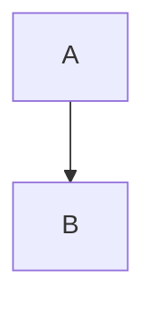

# Guideline оформления курса WAF

<!-- more -->

Этот документ задаёт конвенции оформления материалов курса «WAF for Network Engineers». Цель — единообразие, читаемость и простота поддержки.

## 1. Именование файлов

- Папка курса: `docs/Security/WAF/`.
- Этапы курса: `NN_короткое_имя.md`, где `NN` — двузначный номер этапа (`00`…`09`). Числовой префикс задаёт порядок и в файловой системе, и в навигации.
- snake_case, латиница: `02_deployment_modes.md`.
- Служебные файлы: `index.md` (лендинг-роадмап курса), `guideline.md` (этот файл), `labs.md` (лабораторные).
- Картинки складываются в `docs/images/` с префиксом `waf_` (например, `waf_reverse_proxy.png`).

## 2. Front-matter

Минимальный и обязательный набор:

```yaml
---
title: "Название документа"
---
```

Поле `date` добавляется когда документ готов (контент написан и вычитан). До этого поле `date` отсутствует — тогда макрос `latest_posts()` в `main.py` не выводит черновик в ленту «Последние обновления» (т.к. для попадания в ленту требуются одновременно и `title`, и `date`):

```yaml
---
title: "Название документа"
date: 2026-09-26
---
```

Поле `render_macros` не используется — по умолчанию макросы отключены (`render_by_default: false` в `mkdocs.yml`).

## 3. Навигация (nav в mkdocs.yml)

- Запись в `nav:` добавляется когда документ готов и получает `date`.
- Порядок записей в nav соответствует числовым префиксам файлов.
- Файлы-черновики существуют на диске, но не выводятся в навигацию сайта, пока не готовы.

## 4. Предлагаемая структура документа этапа

````markdown
---
title: "Этап NN: <Название>"
date: YYYY-MM-DD
---

# Этап NN: <Название>

<!-- more -->

<Вводный абзац — что разбираем и зачем. Один-два предложения.>

## Постановка задачи

<Суть проблемы или сценария.>

## Разбор

<Основной контент. Подзаголовки `###` по необходимости.>

## Диаграмма



## Что мы достигли

<Краткое резюме — что читатель теперь умеет/понимает.>

## Источники

- [Ссылка](https://example.com)
````

- Каждый этап начинается с `# Этап NN:` для единообразия.

## 5. Контентные элементы

### Admonitions

Расширение `admonition` включено. Использовать для подсветок:

```markdown
!!! note "Заметка"
    Дополнительный контекст.

!!! warning "Важно"
    Подводный камень или риск.

!!! tip "Совет"
    Практический совет.

!!! example "Пример"
    Конкретный сценарий или конфиг.
```

### Mermaid-диаграммы

`pymdownx.superfences` с mermaid включён. Использовать для топологий (reverse proxy vs bridge vs CDN-edge), flow-схем, политик. Пример — [SNI-роутинг в nginx](../../../Утилиты/nginx.md).

### Таблицы

Для сравнений (режимы развёртывания, вендоры, модели политик). Таблицы уже используются в KB.

### Блоки кода

Всегда с указанием языка: `bash`, `nginx`, `yaml`, `json`, `http`, `mermaid`.

## 6. Кросс-ссылки внутри KB

Использовать относительные пути — MkDocs корректно их резолвит. Из файлов `Security/WAF/Course/*.md`:

- между файлами курса — короткий относительный путь: `[Этап 02](02_deployment_modes.md)`.

## 7. Терминология и язык

- Язык — русский (соответствует `theme.language: ru`).
- Технические термины сохраняются на английском, если нет устоявшегося перевода: `reverse proxy`, `SSL termination`, `WAF`, `CDN`, `SIEM`, `bot management`, `virtual patching`.
- Аббревиатуры расшифровываются при первом употреблении в документе.
