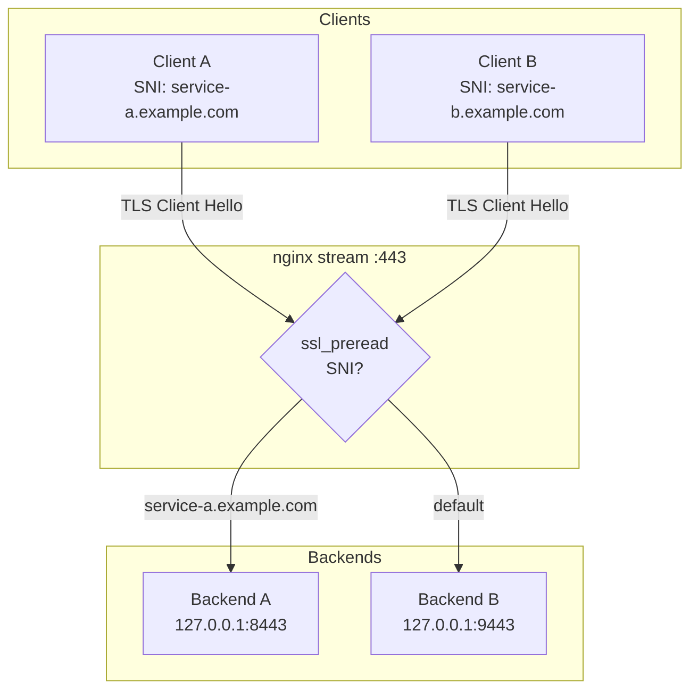

# nginx

## Теоретическая часть

### Версионирование и пакеты

nginx развивается в двух основных ветках:

| Ветка | Назначение |
|---|---|
| **Stable** | Исправления багов и CVE без нового функционала |
| **Mainline** | Новый функционал; часто рекомендуется для большинства пользователей |

Актуальные номера версий нужно смотреть на [nginx.org](https://nginx.org/en/download.html).

#### Как Ubuntu поставляет nginx в LTS-релизе

Дистрибутивные репозитории Ubuntu для LTS-релизов фиксируют мажорную версию nginx на момент заморозки дистрибутива. Например, в Ubuntu 24.04 поставляется nginx 1.24.0, и Ubuntu продолжает выпускать патчи безопасности внутри этой линейки.

**Важно:** бэкпортирование работает не всегда. Если upstream-фикс ломает ABI и несовместим с third-party модулями из репозитория Ubuntu, мейнтейнеры могут отключить патч (в changelog такие случаи помечаются как `SECURITY REGRESSION`). Для закрытия такого CVE остаётся только переход на пакеты upstream или самостоятельная сборка.

Перед обновлением стоит проверять два источника:

- `apt changelog nginx` — какие CVE уже закрыты бэкпортом в текущей Ubuntu-версии;
- [nginx.org security advisories](https://nginx.org/en/security_advisories.html) — какие версии остаются уязвимыми.
<!-- more -->
### Отличия пакетов Ubuntu и nginx.org

| Параметр | Ubuntu-пакет | nginx.org-пакет |
|---|---|---|
| Версия в Ubuntu 24.04 | 1.24.0 | Последняя stable/mainline |
| Пользователь процесса | `www-data` | `nginx` |
| Подключение модулей | Динамические через `modules-enabled/*.conf` | Статические; `load_module` обычно не нужен |
| Подключение сайтов | `sites-enabled/*` | `conf.d/*.conf` |
| Third-party модули | Доступны в виде `libnginx-mod-*` | Не поставляются |

**Важно:** если конфигурация использует модули вроде `auth_pam`, `geoip2`, `echo`, `subs_filter` или `upstream_fair`, переезд на nginx.org потребует отдельной сборки этих модулей из исходников.

### SNI-роутинг на L4

nginx может работать в режиме `stream` и маршрутизировать TCP-трафик на основе SNI (Server Name Indication) без расшифровки TLS. Это полезно, когда на одном IP-адресе нужно разделить TLS-сервисы: например, веб-сервер и VPN.



- `ssl_preread` читает SNI из Client Hello без терминирования TLS.
- `proxy_protocol on` добавляет заголовок PROXY protocol при передаче соединения upstream'у.
- `map $ssl_preread_server_name` выбирает upstream по доменному имени.

**Важно:** сертификаты TLS настраиваются на конечных backend-сервисах, а не в nginx stream.

---

## Переезд с Ubuntu-репозитория на официальный репозиторий nginx

### 1. Бэкап

```bash
# Полный бэкап конфигов, логов и webroot
sudo tar czf /root/nginx-backup-$(date +%Y%m%d).tar.gz /etc/nginx/ /var/log/nginx/ /usr/share/nginx/

# Отдельная копия nginx.conf для быстрого отката
sudo cp /etc/nginx/nginx.conf /root/nginx.conf.bak
```

### 2. Аудит используемых модулей

```bash
# Какие модули явно загружаются в конфигах
grep -r "load_module" /etc/nginx/

# Используются ли директивы сторонних модулей
grep -rE "(auth_pam|geoip2|echo_|subs_filter|upstream_fair)" /etc/nginx/
```

**Важно:** если обе команды возвращают пустой вывод, third-party модули не задействованы и переезд будет прямолинейным. Иначе потребуется сборка соответствующих модулей под новую версию nginx.

### 3. Подключение репозитория nginx.org

```bash
sudo apt install -y curl gnupg2 ca-certificates lsb-release ubuntu-keyring

# Импорт GPG-ключа
curl -fsSL https://nginx.org/keys/nginx_signing.key \
  | gpg --dearmor \
  | sudo tee /usr/share/keyrings/nginx-archive-keyring.gpg >/dev/null

# Проверка fingerprint: должен отобразиться 573BFD6B3D8FBC641079A6ABABF5BD827BD9BF62
gpg --dry-run --quiet --no-keyring --import \
  --import-options import-show /usr/share/keyrings/nginx-archive-keyring.gpg

# Добавление stable-репозитория
echo "deb [signed-by=/usr/share/keyrings/nginx-archive-keyring.gpg] https://nginx.org/packages/ubuntu noble nginx" \
  | sudo tee /etc/apt/sources.list.d/nginx.list

# Приоритет пакетов nginx.org над Ubuntu
printf "Package: *\nPin: origin nginx.org\nPin: release o=nginx\nPin-Priority: 900\n" \
  | sudo tee /etc/apt/preferences.d/99nginx

sudo apt update
```

**Важно:** fingerprint ключа обязательно сверить вручную перед продолжением.

### 4. Проверка доступной версии

```bash
apt-cache policy nginx
```

`Candidate` должен показывать версию актуальную для nginx-репо с приоритетом `900`.

### 5. Замена пакетов

```bash
# Остановить nginx перед удалением
sudo systemctl stop nginx

# Удалить Ubuntu-пакеты. Конфиги в /etc/nginx/ не удалятся, если они изменялись.
sudo apt remove --purge -y nginx nginx-full nginx-common libnginx-mod-*
sudo apt autoremove --purge -y

# Установить nginx из официального репозитория
sudo apt install -y nginx
```

### 6. Восстановление конфигурации

Пакет nginx.org заменяет `nginx.conf` на свой шаблон. Нужно восстановить проектную конфигурацию, поправив:

- пользователя: `www-data` → `nginx`;
- подключение модулей: удалить `include /etc/nginx/modules-enabled/*.conf`;
- пути подключения сайтов: `conf.d/*.conf` и при необходимости `sites-enabled/*`.

Пример `nginx.conf` с SNI-роутингом:

```bash
sudo tee /etc/nginx/nginx.conf <<'EOF'
user nginx;
worker_processes auto;
pid /run/nginx.pid;
error_log /var/log/nginx/error.log notice;

events {
    worker_connections 768;
}

http {
    sendfile on;
    tcp_nopush on;
    types_hash_max_size 2048;

    include /etc/nginx/mime.types;
    default_type application/octet-stream;

    ssl_protocols TLSv1 TLSv1.1 TLSv1.2 TLSv1.3;
    ssl_prefer_server_ciphers on;

    access_log /var/log/nginx/access.log;

    gzip on;

    include /etc/nginx/conf.d/*.conf;
    include /etc/nginx/sites-enabled/*;  # если используется sites-enabled
}

stream {
    map $ssl_preread_server_name $upstream_name {
        service-a.example.com backend_a;  # заменить на реальный домен
        service-b.example.com backend_b;  # заменить на реальный домен
        default backend_b;
    }

    upstream backend_a {
        server 127.0.0.1:8443;
    }

    upstream backend_b {
        server 127.0.0.1:9443;
    }

    server {
        listen 443 reuseport;
        ssl_preread on;
        proxy_protocol on;
        proxy_pass $upstream_name;
    }
}
EOF
```

**Важно:** замените `service-a.example.com` и `service-b.example.com` на реальные домены, по которым клиенты подключаются. Несовпадение SNI приведёт к тому, что трафик пойдёт в `default` upstream.

### 7. Проверка и запуск

```bash
sudo nginx -t
sudo systemctl start nginx
sudo systemctl status nginx --no-pager

# Проверка слушаемых портов
sudo ss -tlnp | grep nginx
```

### 8. Финальная верификация

```bash
nginx -v                                         # ожидается nginx/1.30.4
cat /var/run/reboot-required 2>/dev/null || echo "No reboot required"
```

### Откат

```bash
# Удалить nginx.org-пакеты и репозиторий
sudo apt remove --purge -y nginx nginx-module-*
sudo rm /etc/apt/sources.list.d/nginx.list /etc/apt/preferences.d/99nginx
sudo apt update

# Вернуть Ubuntu-пакеты
sudo apt install -y nginx nginx-full nginx-common libnginx-mod-stream

# Восстановить исходный nginx.conf
sudo cp /root/nginx.conf.bak /etc/nginx/nginx.conf

# Если конфиги сайтов менялись — развернуть полный бэкап
# sudo tar xzf /root/nginx-backup-*.tar.gz -C /

sudo nginx -t && sudo systemctl restart nginx
```

### Источники

- [Официальная инструкция по установке nginx из репозитория](https://nginx.org/en/linux_packages.html)
- [Security Advisories nginx](https://nginx.org/en/security_advisories.html)
