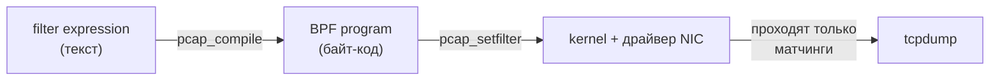

# tcpdump

## Основы

`tcpdump` — утилита командной строки для захвата и анализа сетевых пакетов в реальном времени. Работает поверх библиотеки **libpcap**, которая предоставляет кроссплатформенный API для перехвата трафика. Под Windows аналогом выступает **WinPcap / Npcap** (используется в Windump, Wireshark).

### libpcap и BPF-фильтрация

`tcpdump` не сам решает, какие пакеты показывать — он передаёт текстовое выражение (`filter expression`) в `libpcap`, та компилирует его в байт-код **BPF** (Berkeley Packet Filter) и загружает в ядро. Фильтрация происходит максимально «близко к железу», поэтому неподходящие пакеты отбрасываются ещё до попадания в пользовательское пространство.


<!-- more -->
### Примитивы

Базовые «кирпичики», из которых строится фильтр:

| Примитив | Назначение | Пример |
|---|---|---|
| `host` | IP-адрес источника или получателя | `host 10.0.1.10` |
| `src host` | Только исходящий от хоста | `src host 10.0.1.10` |
| `dst host` | Только входящий к хосту | `dst host 10.0.1.10` |
| `port` | TCP или UDP порт | `port 80` |
| `tcp port` / `udp port` | Порт с уточнением протокола | `tcp port 443` |
| `net` | Подсеть в CIDR | `net 10.0.0.0/24` |
| `proto` | Номер IP-протокола | `proto 47` (GRE) |
| `icmp`, `tcp`, `udp`, `ip`, `ip6`, `arp` | Сокращения для протоколов | `icmp` |

### Логические операторы

| Оператор | Сокращение | Значение |
|---|---|---|
| `and` | `&&` | И |
| `or`  | `\|\|` | ИЛИ |
| `not` | `!`  | отрицание |

Приоритет: `not` → `and` → `or`. Для явной группировки — круглые скобки.

### Приоритет и кавычки

Shell интерпретирует `&`, `|`, `(`, `)` как свои управляющие символы, поэтому всё выражение **оборачивается в одинарные кавычки** `'...'`:

```bash
tcpdump -n '(host 10.0.1.10 and port 80) or (host 10.0.2.20 and port 443)'
```

Двойные кавычки `"` допускают подстановку переменных shell, что обычно не нужно и может привести к неожиданным интерпретациям.

### Связь с моделью TCP/IP

`tcpdump` видит пакеты на уровне **L2** (Data Link) — до того, как стеку ОС начнёт их обрабатывать. Это позволяет фильтровать и анализировать трафик на всех уровнях: Ethernet, IP, TCP/UDP и выше. Поэтому в фильтрах доступны MAC-адреса (`ether host`), IP (`host`, `net`) и транспортные порты (`port`) одновременно.

## Базовый захват пакетов
```bash
# Захват на интерфейсе eth0, вывод в реальном времени
sudo tcpdump -i eth0
```

**Примечание:** Без фильтра трафика очень много — использовать `-c` для ограничения.

## Фильтрация по хосту и порту (host or port)
```bash
# Трафик хоста 192.168.1.1 ИЛИ порт 80
sudo tcpdump -n 'host 192.168.1.1 or port 80'

# Трафик хоста 10.0.0.5 ИЛИ подсети 10.0.1.0/24
sudo tcpdump -n 'host 10.0.0.5 or net 10.0.1.0/24'
```
**Важно:** Всегда заключать фильтр в кавычки, чтобы shell не интерпретировал `&`, `|`, `(`.

## Сложные фильтры с группировкой
```bash
# (хост А И порт 22) ИЛИ (хост Б И порт 53)
sudo tcpdump -n '(host srv-app-01 and port 22) or (host 10.0.1.10 and port 53)'
```

## Захват по протоколу и типу трафика
```bash
# Только ICMP
sudo tcpdump -n icmp

# Только TCP-пакеты на порту 443
sudo tcpdump -n 'tcp port 443'

# UDP-трафик DNS + отображение портов и имён (без обратного разрешения)
sudo tcpdump -n -i any 'udp port 53'
```

## Запись в файл и чтение из файла
```bash
# Запись в pcap-файл
sudo tcpdump -i eth0 -w capture.pcap

# Чтение из файла с фильтром
tcpdump -r capture.pcap 'host 10.0.1.10'
```

**Ограничение:** Файл `.pcap` переносим между системами, читать можно Wireshark.

## Увеличение информативности вывода
```bash
# Показывать MAC-адреса, номера портов, TTЛ
tcpdump -enn -i eth0 'icmp'

# Просмотр пакета в HEX и ASCII
tcpdump -X -i eth0 'tcp port 80'
```
**Примечание:** Опции `-v`, `-vv`, `-vvv` добавляют уровни детализации.

## Мониторинг конкретного интерфейса с ограничением количества пакетов
```bash
# Захватить 100 пакетов на lo и завершиться
tcpdump -i lo -c 100 -n
```

## Исключение трафика (not)
```bash
# Всё, кроме SSH
tcpdump -n 'not port 22'

# Весь трафик, кроме ICMP и порта 53
tcpdump -n 'not icmp and not port 53'
```

### Источники

- `man tcpdump`
- [pcap-filter man page](https://www.tcpdump.org/manpages/pcap-filter.7.html)